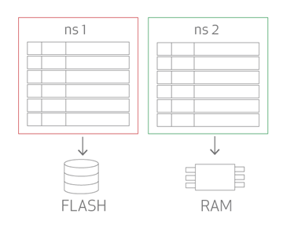

# Data Model

Aerospike 数据模型不完全符合刚性模式（rigid schema，即需有 database，schema，data type，table 等），对数据类型的变更不需要修改 schema，且能随时添加新的 bin 类型。接下来讨论下 Aerospike 数据模型和存储相关的基本概念。

## Namespaces
Namespaces 是最顶层的数据容器，一个 namespace 相当于标准关系型数据库的一部分数据库或一组数据库。一个 namespace 中包含 record，index 和 policies，policies 描述了 namespce 的行为，包括：
- 数据如何存放：存内存还是存磁盘。
- record 的复本数。
- record 何时过期。

一个数据库能指定多个 namespaces，每个 namespaces 都有各自对应的 policies。如下图，一个数据库有两个 namespaces：ns1 和 ns2，其中 ns1 将 record 存在磁盘中，ns2 将 record 存在内存中：

## Sets
Sets 相当于关系型数据库的表，其将多条 records 组织成一个集群。 Sets 继承了 namespace 的 policies，并能添加额外的 policies 和操作。

## Records
Records 是数据库的基本存储单元，Records 使用 key 做为唯一标识。Records 由如下形式组成：

组件  | 定义
----|--------
key | 唯一标识符。通过 hash 后的 key （被称为 digest）可得到该 record 的地址。
metadata | Record 的版本信息（generation）和过期时间（TTL）。
bins | 字段。

### Keys 和 Digests
当 key 被发送给数据库时，key 及 set 信息会做 hash 成为一个 16位的 digest，digest 用于定位 record。

### Metadata
每个 record 都包含如下 metadata：
- generation    
  generation 跟踪 record 的修改记录，在读取 record 时，generation 会返回给应用端，用于判断距离上次读取时是否有新的修改。
- ttl (time-to-live)     
  定义 record 的过期时间。
- lut (last-update-time)              
  定义 record 的变更时间。

## Bins
在 record 中，数据存储在一个或多个 bins 中。Bins 由 name 和 value 组成，Bins 不需要指定数据类型，数据类型由存储的 value 定义。

## 参考
- [Data Model](https://www.aerospike.com/docs/architecture/data-model.html)
