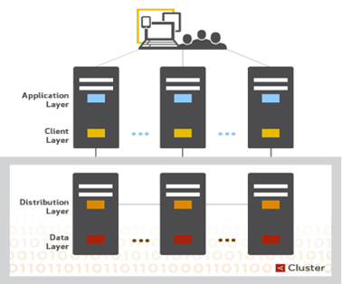

# Architecture Overview

## 结构
Aerospike 由以下三层组成：

- 客户端层: client 层主要实现了 Aerospike 的各种 APIs、跟踪节点和感知数据保存在集群中的位置等功能。
- 集群和数据分发层：该层主要管理集群内部的通信、自动恢复、复制、跨数据中心的同步、数据平衡和数据迁移。
- 数据存储层：该层主要实现将数据保存到 DRAM 和 Flash 中用于快速检索。

### 客户端层
客户端层的设计主要基于速度方面的考虑。该层主要特点如下：
- 实现了 Aerospike API、client-server 的通信协议和直接同集群通信等功能。
- 根据节点并感觉数据存储位置，能即时接收到集群配置的变更和开启关闭节点。
- 为了提升效率实现了自己的 TCP/IP 连接池。并能检查到集群中低于节点故障级别的失败事务，再重新将这些事务提交到有相同数据备份的节点中。
- 能直接将请求发送到存储数据的节点上。

这种架构减少事务延迟，消除开发都需要做的工作，保证应用不需要在节点故障时重启。

### 分发层
Aerospike “shared nothing” 架构模式的目的是可靠存储 tb 级别的数据，同时具有自动恢复、复制、跨数据中心同步等功能。这层节点能线形的进行扩充。这层主要有 3 个模块：
- 集群管理模块     
  该模块用于跟踪集群中的节点。核心算法是一个基于 Paxos 的 gossip-voting 过程，其主要用于判断节点是不是属于集群。Aerospike 实现了一种特殊的心跳用于监听内部节点之间的通信。
- 数据迁移模块     
  Aerospike 通过一致性 Hash 算法，将数据分成片并将这些片分配给相应的 owner。当添加/删除节点时，Aerospike 的数据迁移模块会将数据分发到集群中所有节点上，保证每一小块的数据复本能跨数据中心和集群节点分布。
- 事务处理模块       
  处理读写请求，并提供一致性和隔离性的保证。该模块主要职责如下：
  - 同步/异步复制：对于写提供即时一致性(immediate consistency)，将对数据的变更传播给所有复本后再提交数据并返回对果给客户端。
  - 代理：当集群配置变更时，在极少数情况下客户端层的配置可能会过期，此时事务处理模块会将请求代理给另外的节点。
  - 提供重复数据的解决方案：当集群恢复分区的数据时，事务处理模块能解决同一数据多份复本之间不一致性的冲突，解决方案是配置版本号或过期时间。

### 数据存储层 
Aerospike 是一个类似传统数据库结构的 kv 型存储。数据存储在 namespaces，类似于 RDBMS 系统中的数据库的概念。在一个 namespace 中，数据被分成 sets （类似 RDBMS 中的数据表），和 records （类似 RDBMS 中的行）。在 set 中的每个 record 都有一个唯一的索引 key，和一个或多个 bins（类似 RDBMS 中的列）用于存放与 record 相关的值。

关系对应表：
| RDBMS  | Aerospike
|--------|--------
| Database | Namespace
| Table   | Set
| Row    | Record
 | Column  | Bin

bin 的值是强类型的，其能包括任意支持的数据类型，bin 没有类型概念，因此不同 record 的同一 bin 的值可以是不同类型的。索引（即key，包括一级索引和二级索引）存储在 DRAM 方便快速读取，面值能存储在 DRAM 或 SSD 中。不同的 namespace 能配置不同的存储，因此对于数据量较小的 namespace 可将其值也存储在 DRAM 中， 对数据量大的 namespace 将其值存储在 SSD 中。

有几点需要注意的：
- 即使 key 的大小不做限制，每个 key 仍以 64 字节大小高效存储。因此 1 亿量级的 key 仅占用 6.4GB 大小空间。
- 对于传统机械磁盘，设置较大级别的 write block 能尽可能小的优化延迟。
- 碎片管理（Smart Defragmenter）和剔除（Intelligent Evictor）机制能保证 DRAM 中有足够的内存保存数据。
  - Smart Defragmenter：跟踪每个 block 的 活动 record 数目，回收活动 record 数目低于最小级别使用的 block。
  - Intelligent Evictor：当系统内存高于设置的高水准线时，删除过期的数据并回收内存。每个 namespace 都有配置的过期时间，record 生命时长从最后一次变更开始计算。

## 操作 Aerospike

和传统关系型数据不同的是，在 Areospike 中，创建和管理数据的几种方式如下：
- 通过配置初始 namespace 设置：在安装 Aerospike 时，集群中每个节点的 namespace 都必须配置如何创建和复制 namespace，在启动 server 时会创建 namespace。 
- 通过操作 namespace ：
  - 首次涉及到 set 和 bin 时，会创建namespace 的 schema。
  - Aerospike 的 namespace 是一个弹性的 schema，即在需要添加新的 bin 时，只需要将值保存到指定的 bin 上即可。
- 通过更新配置文件：只需修改配置文件即可更新 namespace 的参数。

Aerospike 同时提供了 [管理组件](https://www.aerospike.com/docs/amc/index.html) 和 [监控工具](https://www.aerospike.com/docs/operations/monitor/index.html) 用于节点管理。当增删节点时，集群会自动重新配置。

## 创建应用
定义好 namespace 后，就能使用 Aerospike 提供的工具判断数据是否被正确存储。为执行操作，使用 Smart Client 来实例化应用，Smart Client 拥有位置感知能力，其在不影响性能的情况下知道如何存储和获取数据。
