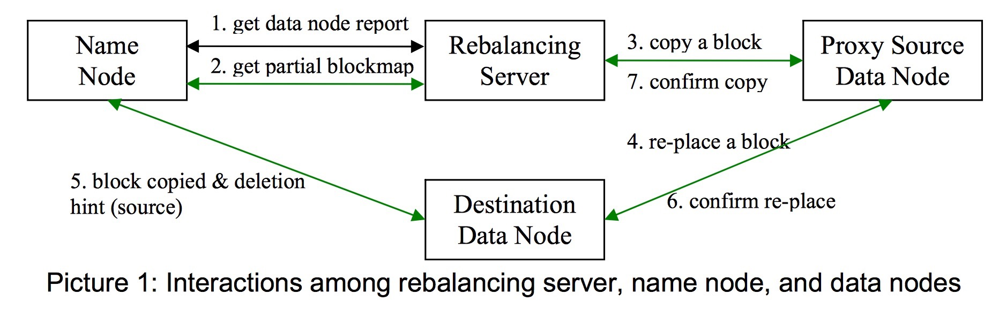

Hadoop Rebalance
===

条件
---

数据在做 rebalance 的时候，需要满足以下条件：

- rebalance 需要满足数据可用性：
 - block 不能丢失
 - 不能改变 block 副本数
 - 不能减少 block 分布的 rack 数
- 系统管理员能在命令行中调用和中断 rebalance 脚本
- 移动 block 时必须限流，防止占用过多网络资源
- rebalance 不能导致 namenode 太忙而无法处理请求

rebalance 的一些说明
---

utilization 指 datanode 中已用空间与可用空间的百分比，可用空间指分配给 HDFS 使用的空间，而非节点所在机器的全部磁盘空间大小。而average utilization是对所有节点的简单平均，如三个datanode的HDFS大小分别为 2T, 2T, 1T，utilization 分别为80%, 40%, 30%，则平均 utilization 是（80% + 40% + 30%）/3=50%，而非(80%*2 + 40%*2 + 30%*1)/(2+2+1)=54%。 

threshold 默认为 10%，可自定义设置。

在文档中有如下说明：
> The rebalancing server makes rebalancing decision iteration by iteration. At each iteration the major goal is to make every over/under-utilized data node less imbalanced rather than reducing the number of imbalanced data nodes.

每次rebalance是为了减少每个 over/under-utilize datanode 的不平衡情况，而不是彻底减少不平衡节点的数目。即若 threshold 指定为 25%，则当3个datanode的utilization分别为 75%, 42%, 36%，rebalance也会停止。每次 rebalance 只要达到既定条件即停止，也即缩小了 over/under-utilization 节点与集群average utilization 间的差值，通过反复运行rebalance使集群趋于平衡。

运行 rebalance 的方法是在datanode端（非namenode）运行`hadoop balance [-t <threshold>]`。此时会在运行rebalance的机器上起一个独立的进程，然后过程如下：

从上图中可以看到几点：

1. 数据是从距目标节点最近的或load低于源节点的代理节点（有源节点中待移动的block）复制过去，当复制完成后，目标节点通知namenode在保证满足条件1的情况下删除源节点的block副本。

2. rebalance 由 rebalance server 控制，而不是namenode。

节点的选择策略
---

rebalance server 从 namenode 中请求数据节点信息，计算出网络拓扑，集群average utilization，然后把各个数据节点分成over-utilized node，under-utilized node，above-average-utilized node(大于avervage utilization 但小于 average utilization + threshold 的node)，below-average-utilized node。若集群到达平衡状态或进程终止，则退出rebalance，否则一直遍历 over-utilized node 和 under-utilized node 列表，直到满足这两个条件。相应的策略如下：

对于 over-utilized node 列表，目标节点按如下顺序选择：

- 同一机架上的 under-utilized node
- 同一机架上的 below-average-utilized node
- 其它机架上的 under-utilized node
- 其它机架上的 below-average-utilized node

对于 under-utilized node 列表，则源节点的选择顺序如下：

- 同一机架上的 over-utilized node
- 同一机架上的 above-average-utilized node
- 其他机架上的 over-utilized node
- 其他机架上的 above-average-utilized node
 
若源节点是over-utilized node, rebalance 移动的 byte 大小（注意不是block）如下取值：
> if the source is over-utilized, the size is MIN(size of the threshold, 1GB); if the source is above-average-utilized, the size is equal to MIN(its capacity - average capacity, 2GB)

若目标节点是 under-utilizee node，则移动的 byte 大小取值如下：
> if the destination is under-utilized, the size is equal to MIN(the threshold size, 1GB); if the destination is below-average-utilized, the size is equal to MIN(average capacity-its capacity, 2GB)

rebalance server 向namenode请求每个源节点的部分block map，请求的形式是`<source, size>`，size 为1GB。namenode 接收到请求后，随机选择请求大小（1GB）的block，将其信息返回给 rebalance server。rebalance server 选择移动源datanode上的block，当选择的block大小到达上述说的移动byte大小或者所有从namenode接收过来的block都被遍历一遍后，选择结束。选择标准如下：

- 在满足条件1的前提下：
 - 若源节点和目标节点在不同机架上，则目标节点所在机架上不能有该block的其它副本 
 - 目标节点不能有该block的副本
 - 不允许并发的移动该block的多个副本
- block移动任务被放到 pendingMove 队列中，然后把copy请求发给源datanode。 pendingMove 队列中按 source，destination，block 建立索引，保证source 队列和 destination 队列大小最多为5，同时限制每个节点最多同时有5份数据传输，且每个block同时只有一份数据传输。当接收到源节点的确认消息后或队列长时间没反馈，该任务会从列队中删除。

循环执行上面过程，直到集群达到平衡状态或rebalance进程被终止。

rebalance 时 datanode 上的一些注意项
---

每个datenode用于rebalance的带宽都是有限制的，默认是5MB/s。每个 datanode 并发的数据传输个数（包括发送和接收）不能超过5个，即在最坏的情况下，每个数据传输的带宽限制为1MB/s。 

Reference
---

- [HDFS的Rebalance功能](http://www.itpub.net/thread-1737512-1-1.html)
- [Rebalance Design 6](https://issues.apache.org/jira/secure/attachment/12368261/RebalanceDesign6.pdf)
- [Rebalance data blocks when new data nodes added or data nodes become full](https://issues.apache.org/jira/browse/HADOOP-1652)

