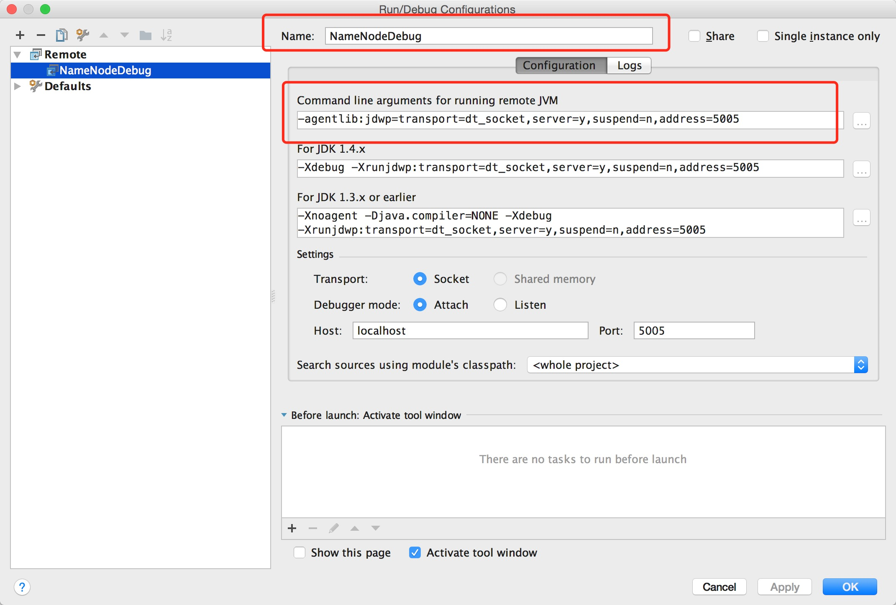
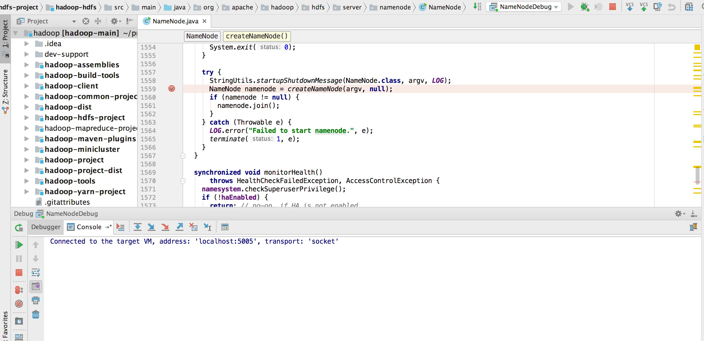

## 编译 Hadoop 源码

### 准备
- Unix/Linux OS
- JDK 1.7+
- Maven 3.0+
- ProtocolBuffer 2.5.0

关于上述软件的安装这里略去，如需编译 native code，还需要 CMake 2.6+，Zlib-devel，Openssl-devel等，这里暂不考虑。

### 安装 Hadoop
下载源码并编译出二进制文件，执行命令如下：
```
# git clone git@github.com:apache/hadoop.git
# cd hadoop
# git check branch-2.7.3
// 编译二进制文件
# mvn package -Pdist -DskipTests -Dtar
# cd hadoop-dist/target/hadoop-2.7.3
// 查看 hdfs 版本 
# bin/hdfs version
Hadoop 2.7.3
Subversion https://github.com/apache/hadoop.git -r baa91f7c6bc9cb92be5982de4719c1c8af91ccff
```

接着修改配置文件，其中 `etc/hadoop/core-site.xml` 修改如下：
```
<configuration>
  <property>
    <name>fs.default.name</name>
    <value>hdfs://localhost:9000</value>
  </property>
</configuration>
```

`etc/hadoop/hdfs-site.xml` 修改如下：
```
<configuration>
  <property>
    <name>dfs.replication</name>
    <value>1</value>
  </property>
</configuration>
```
接着给本用户登录本机设置免密码登录，使用 `ssh localhost` 进行验证。若成功，接下来执行如下步骤：
```
// 格式化 namenode
# bin/hdfs namenode -format
// 启动 hdfs
# sbin/start-dfs.sh
```

在浏览器中打开 http://localhost:50070, 即可看到 namenode web 页面，说明安装成功。

### 调试 Hadoop 

- 设置hadoop-envs.h  
在 IntelliJ IDEA 中打开 Hadoop 源码，点击 Run --> Edit Configurations --> Add New Configuration --> Remote，修改其名字为 NameNodeDebug，点击 Apply，如下图：



接着复制 Command line arguments for running remote JVM 的设置值：`-agentlib:jdwp=transport=dt_socket,server=y,suspend=n,address=5005`，将其粘贴于 etc/hadoop/hadoop-env.sh 中，如下：

```
export HADOOP_NAMENODE_OPTS="-agentlib:jdwp=transport=dt_socket,server=y,suspend=y,address=5005"
export HADOOP_NAMENODE_OPTS="-Dhadoop.security.logger=${HADOOP_SECURITY_LOGGER:-INFO,RFAS} -Dhdfs.audit.logger=${HDFS_AUDIT_LOGGER:-INFO,NullAppender} $HADOOP_NAMENODE_OPTS"
```
将 `suspend=n` 修改为 `suspend=y`，这样 hdfs 会挂起在任何 debug namenode 的地方。

- 挂起 NameNode 在 5005 端口监听    
重启 Hadoop：
```
# sbin/stop-dfs.sh
# sbin/start-dfs.sh
# jps
44932 SecondaryNameNode
44745 -- main class information unavailable
45275 Jps
44828 DataNode
```

在启动过程中，如果看到 `localhost: Listening for transport dt_socket at address: 5005` 则说明调试模式下启动 namenode 成功。

- 设置断点     
在 IntelliJ 中设置断点。 

- 调试  
打开 IntelliJ，点击 NameNodeDebug 旁边的 Debug 按钮，开始调试。如下图：




### 参考
- [BUILDING.txt](https://github.com/apache/hadoop/blob/branch-2.7.3/BUILDING.txt)
