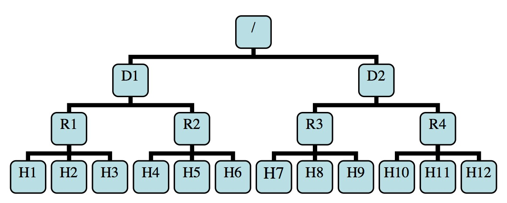

Hadoop Rack Awareness
===

HDFS 和 Map/Reduce 都具备机架感知能力。

机架感知有什么用？
---
1. 将数据保存在不同 rack 中，保证数据安全性。
2. 当读数据时， namenode 检查 client 是否在集群中，若是，根据离该 client 由近到远的顺序返回 block 位置。

机架感知过程
---

若整个集群的拓扑图如下(图来自于参考1。D代表datacenter, 数据中心的意思)：



其中 R1 的位置为 /D1/R1，H8的位置为 /D2/R3/H8，R3 为 H8 的父节点。

当 datanode 启动时，需要知道它在集群中的位置，才能构造完整的拓扑图。datanode 从命令行中可获取到其父节点的位置，相应的参数是`-p <id>` 或 `--parent <id>`。若该参数没设置，则 datanode 的父节点是默认的。至于如何获取父节点，由Hadoop实现方来决定。一种方法是将当前节点的父节点信息打印到标准输出中，datanode 启动时会从标准输出中获取该信息。如CDH版启动集群时，在标准输出中看到其父节点的信息：`INFO org.apache.hadoop.net.NetworkTopology: Adding a new node: /default-rack/10.10.9.54:50010`，可以看到父节点为 `/default-rack`。datanode 将自己的位置作为注册信息中的一部分发给 namenode，namenode 会根据这些信息决定是否更新网络拓扑。

节点间的距离也可以计算出来，子节点与父节点间的距离为1，与其它节点的距离为最短路径长度。如上图中 distance(/D1/R1/H1, /D1/R1/H2)=2, distance(/D1/R1/H1, /D2/R3/H7)=6。

Replica placement 
---

- 创建新 block 块时
 - 若在datanode上执行写操作，则第一份副本(replica)保存在本地节点，否则随机选取一个datanode存入第一分副本（参考[源码](https://github.com/apache/hadoop/blob/trunk/hadoop-hdfs-project/hadoop-hdfs/src/main/java/org/apache/hadoop/hdfs/server/blockmanagement/BlockPlacementPolicyDefault.java#L44)中注释）
第一份副本(replica)放在本地节点
 - 第二份副本放在不同机架中
 - 第三份副本放在存放第一份副本的机架上的不同节点中
 - 多余的副本按以下规则随机存放
    - 一个节点中最多只能有一份副本
    - 当副本数少于2倍的机架数时，每个机架中最多只能有两份副本

- 复制 block 块时
 - 已有一份副本时，第二个副本放在不同机架上
 - 当有两份副本时，若这两份副本在同一机架上，则将第三份副本放在不同机架上，否则第三份副本和第一份副本放在同一机架上
 - 若已保存（可用）的副本数大于2，则剩下的副本可随机存放

自定义topology
---
在 core-site 中可以自定义设置topylogy，需要配置 `net.topology.script.file.name` 项，若没有设置，则默认为所有节点在同一个机架 `/default-rack` 中。对于script，基本要做的就是打印中各节点所在的rack，参考 cdh 的写法，如下：
```
#!/usr/bin/env python
#
# Copyright (c) 2010-2012 Cloudera, Inc. All rights reserved.
#
 
'''
This script is provided by CMF for hadoop to determine network/rack topology.
It is automatically generated and could be replaced at any time. Any changes
made to it will be lost when this happens.
'''

import os
import sys
import xml.dom.minidom
from string import join
 
def main():
  MAP_FILE = '{{CMF_CONF_DIR}}/topology.map'
  DEFAULT_RACK = '/default'

  if 'CMF_CONF_DIR' in MAP_FILE:
    # variable was not substituted. Use this file's dir
    MAP_FILE = os.path.join(os.path.dirname(__file__), "topology.map")

  # We try to keep the default rack to have the same
  # number of elements as the other hosts available.
  # There are bugs in some versions of Hadoop which
  # make the system error out.
  max_elements = 1

  map = dict()

  try:
    mapFile = open(MAP_FILE, 'r')

    dom = xml.dom.minidom.parse(mapFile)
    for node in dom.getElementsByTagName("node"):
      rack = node.getAttribute("rack")
      max_elements = max(max_elements, rack.count("/"))
      map[node.getAttribute("name")] = node.getAttribute("rack")
  except:
    default_rack = "".join([ DEFAULT_RACK for _ in xrange(max_elements)])
    print default_rack
    return -1
  
  default_rack = "".join([ DEFAULT_RACK for _ in xrange(max_elements)])
  if len(sys.argv)==1:
    print default_rack
  else:
    print join([map.get(i, default_rack) for i in sys.argv[1:]], " ")
  return 0

if __name__ == "__main__":
  sys.exit(main())
```

而 topology.map 如下：
```
<?xml version="1.0" encoding="UTF-8"?>

<!--Autogenerated by Cloudera Manager-->
<topology>
  <node name="hd10-001" rack="/default"/>
  <node name="10.10.8.2" rack="/default"/>
  <node name="hd10-002" rack="/default"/>
  <node name="10.10.8.3" rack="/default"/>
  <node name="hd10-003" rack="/default"/>
  <node name="10.10.8.4" rack="/default"/>
  <node name="hd10-004" rack="/default"/>
  <node name="10.10.8.5" rack="/default"/>
  <node name="hd10-005" rack="/default"/>
  <node name="10.10.8.6" rack="/default"/>
  <node name="hd10-006" rack="/default"/>
  <node name="10.10.8.7" rack="/default"/>
  <node name="hd10-007" rack="/default"/>
  <node name="10.10.8.8" rack="/default"/>
</topology>
```

Reference
---

- [Rack_aware_HDFS_proposal.pdf)](https://issues.apache.org/jira/secure/attachment/12345251/Rack_aware_HDFS_proposal.pdf)
- [Configuring Rack Awareness on HDP](http://docs.hortonworks.com/HDPDocuments/HDP2/HDP-2.1.5/bk_system-admin-guide/content/admin_configure_rack_awareness.html)
- [Specifying the Racks for Hosts](http://www.cloudera.com/content/cloudera/en/documentation/archives/cloudera-manager-4/v4-5-1/Cloudera-Manager-Enterprise-Edition-Installation-Guide/cmeeig_topic_11.html)
