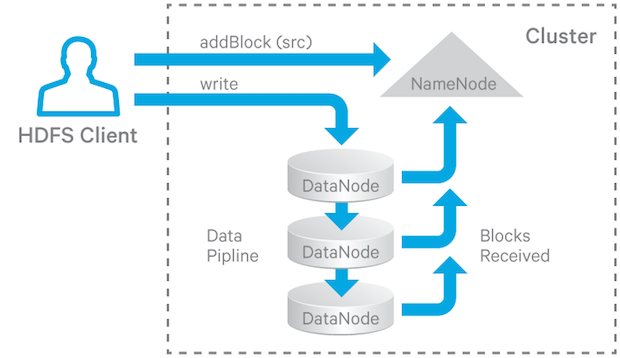
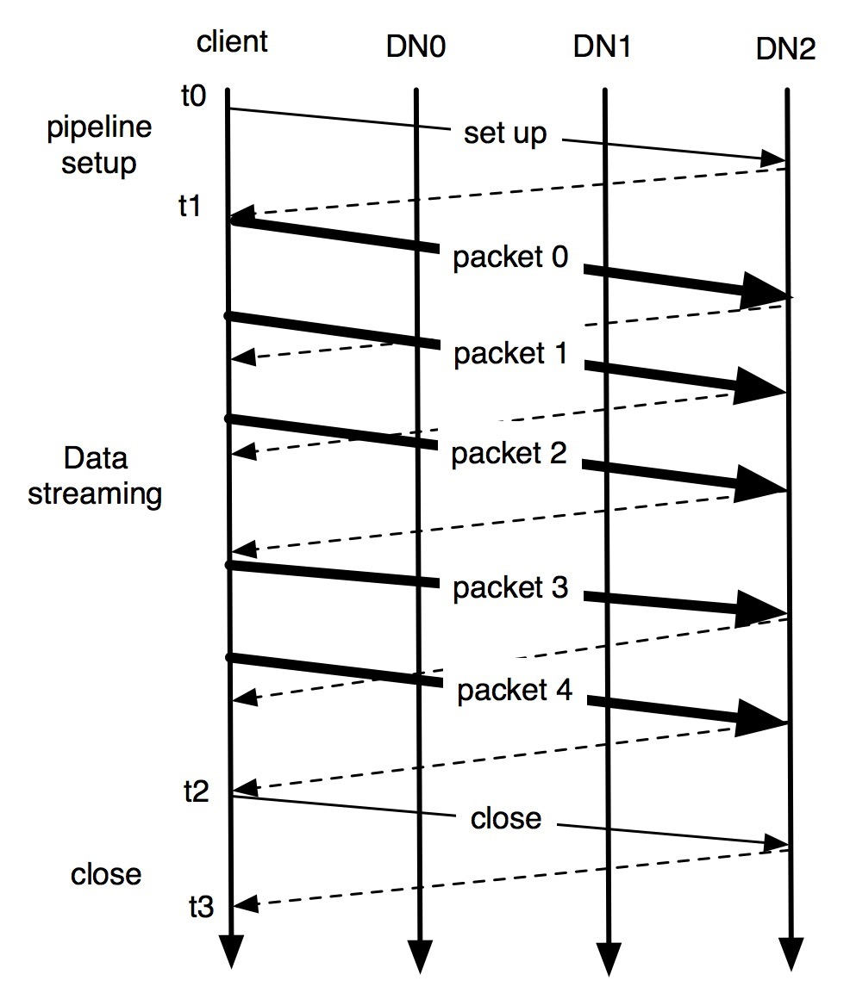

# HDFS Recovery Processes

## Background
为保证HDFS在磁盘，网络或节点出异常的情况下服务仍正常运行，HDFS提供Lease Recovery, Block Recovery和Pipeline Recovery等Recovery机制用于容错。

在说pipeline前，先说下HDFS写文件的过程：

当文件创建或打开时，HDFS写操作创建一个pipeline，用以在DataNode间传输和存储数据。如下图：

- 在客户端写hdfs文件时，其必须获取一个该文件lease，用以保证单一写。如果客户端需要持续的写，其必须在写期间周期性的续借(renew)该lease。如果客户端未续借，lease将过期，此时HDFS将会关闭该文件并回收该lease，以让其它客户端能写文件，这个过程称之为Lease Recovery。
- 在写数据的过程中，如果文件的最后一个block没有写到pipeline的所有DataNodes中，则在Lease Recovery后，不同节点的数据将不同。在Lease Recovery 关闭文件前，需保证所有复本最后一个block有相同的长度，这个过程称为 Block Recovery。仅仅当文件最后一个block不处于COMPLETE状态时，Lease Recovery才会解决Block Recovery。
- 在pipeline写过程中，pipeline中的DataNode可能出现异常，为保证写操作不失败，HDFS需从错误中恢复并保证pipeline继续写下去。从pipeline错误中恢复的过程称为Pipeline Recovery。

## Generation Stamp
对于每个block，都有一个由NameNode维护的8字节的单调递增数字-- Generation Stamp，由主要用于检查block过时的replica：即一个replica的GS小于block的GS。在如下情况会产生新的GS:

- 创建一个新文件。
- 客户端对一个已经存在的文件进行append或者truncate操作。
- 客户端在向DataNode上写数据时发生错误，会请求一个新的GS。
- NameNode对文件发起Lease Recovery操作。

## Lease Recovery and Block Recovery
### Lease Manager
HDFS不支持并发写，其用lease保证唯一写。lease相当于一把带时间限制的写锁，其由NameNode中的lease manager管理，每个namespace都有各自对应的lease manager。lease有两种有效期：soft limit（有效期1分钟）和hard limit（有效期1小时）。lease拥有者在soft limit时间内对文件有唯一写锁，如果该客户端需要一直写，其会启动后台线程不断的续借(renew)lease。在超过soft limit而未达到hard limit时间内，其他客户端可接管该lease。

lease manager支持如下操作：
- 给客户端和文件添加/删除lease。
- 检查lease是否达到soft/hard limit限制。
- 为客户端续借lease。

lease manager每隔2s会启动一个监控线程检查是否有lease达到hard limit限制，如果达到的话，其会触发lease recovery进程回收这些lease。

### Lease Recovery and Block Recovery Algorithm

lease会在如下情况下释放：
- 客户端显式请求NameNode对某个文件进行recoverLease操作。或通过shell命令显示调用：`hdfs debug recoverLease [-path <path>] [-retries <num-retries>]`。
- lease超过soft limit限制而客户端又未续借lease，此时另一客户端可强制接管该lease。
- lease超过hard limit限制而客户端又未续借lease，Namenode将自动关闭文件并释放lease。
- 正常关闭文件时，lease也会释放。

Lease Recovery会触发Block Recovery，当DataNode完成Block Recovery后，文件会被关闭。

参见[Lease Recovery Algorithm](https://github.com/apache/hadoop/blob/branch-2.6.0/hadoop-hdfs-project/hadoop-hdfs/src/main/java/org/apache/hadoop/hdfs/server/namenode/LeaseManager.java#L45)，如下：
> Lease Recovery Algorithm:    
1) Namenode retrieves lease information           
2) For each file f in the lease, consider the last block b of f       
2.1) Get the datanodes which contains b         
2.2) Assign one of the datanodes as the primary datanode p         
2.3) p obtains a new generation stamp from the namenode        
2.4) p gets the block info from each datanode          
2.5) p computes the minimum block length                  
2.6) p updates the datanodes, which have a valid generation stamp, with the new generation stamp and the minimum block length       
2.7) p acknowledges the namenode the update results     
2.8) Namenode updates the BlockInfo          
2.9) Namenode removes f from the lease and removes the lease once all files have been removed            
2.10) Namenode commit changes to edit log      

其中2.3 -- 2.7 即Block Recovery算法。

## Pipeline Recovery
__如下部分主要参考[Append/Hflush/Read
Design](https://issues.apache.org/jira/secure/attachment/12445209/appendDesign3.pdf)。__

当客户端写数据到HDFS文件时，数据是一系列block组成，而block由多个packet组成，写文件时即将一系列packet发送到由一些DataNode组成的pipeline中。如下图：

写pipeline由如下三个阶段组成：
- Pipeline setup。客户端发送随着pipeline发送一个 Write_Block 请求，最后一个DataNode回复一个ack。客户端收到ack后，pipeline处于setup状态，准备写数据。
- Data streaming。数据先在客户端的buffer中缓存起来，直到一个packet满了后，再发送给pipeline。下一次发送packet需在收到上一packet的ack后。如果用户端显示调用`hflush()`（如packet 2），packet在未满前也能发送给pipeline，hflush是一个同步操作，只有收到flush packet的ack后，数据才能接着写。
- Close。只有客户端收到所有packet的ack后，其才会发送一个close请求。

在以上三个阶段，pipeline中DataNode都有可能发生异常，根据不同的阶段，Recovery方法也不同。如下：

### Recovery from Pipeline Setup Failure
- 如果pipeline用于新建一个block，客户端将会丢弃该block，并向NameNode申请一个新的block和新的DataNodes列表组成新的pipeline。
- 如果pipleline用于追加已有的block，客户端将用剩余的DataNodes重建pipeline，并增加block的GS。

### Recovery from Data Streaming Failure
- 当pipeline中的datanode发现error时，该datanode会关闭所有与pipeline的TCP/IP连接与退出pipeline。如果数据没有损坏，该datanode仍将buffer中的数据写到相关block和checksum(METADATA)文件中。
- 当客户端发现错误后，其将停止向pipeline向发送数据，并使用剩下的DataNodes重构一个新的pipeline。此时，block的所有replica的GS都将递增。
- 客户端发送带着新GS的packet，如果DataNode已经收到过这些数据，其将忽略这些数据并沿着pipeline传输给其他Datanode。

### Recovery from Close Failure
若客户端在close阶段发现错误，其将使用剩下的DataNodes重建pipeline。Datanode将block的GS递增，如果replica不是finalized状态，则将其修改为finalized状态。

#### DataNode Replacement Policy upon Failure
若出现异常，有如下几种配置选择是否使用其他Datanode来代替坏掉的Datanode：

- DISABLE    
  禁止Datanode替换，并抛出错误。同NEVER。     
- NEVER   
  若pipeline失败，要相Datanode替换。
- DEFAULT           
  若r为配置的replica数，n为已经存在的replica数。仅当`r>=3` and (`floor(r/2) >= n` or `hflush/append被调用且r>n`) 才进行替换。
- ALWAYS    
  一直使用新的Datanode替换失败的Datanode。若Datanode不能替换则报错。

默认策略是DEFAULT，可通过`dfs.client.block.write.replace-datanode-on-failure.policy`调整。在使用DFAULT和ALWAYS时，若pipeline中只有一个Datanode正常，则recovery将不会成功，客户端也将不能写。原因在于`dfs.client.block.write.replace-datanode-on-failure.best-effort`默认值为false，其会一直retry直到符合指定的策略。若该属性为ture，即使相关策略的条件不满足，客户端仍能继续写。

    

## 参考
- [Understanding HDFS Recovery Processes (Part 1)](http://blog.cloudera.com/blog/2015/02/understanding-hdfs-recovery-processes-part-1/)
- [Understanding HDFS Recovery Processes (Part 2)](https://blog.cloudera.com/blog/2015/03/understanding-hdfs-recovery-processes-part-2/)
- [Append/Hflush/Read
Design](https://issues.apache.org/jira/secure/attachment/12445209/appendDesign3.pdf)
