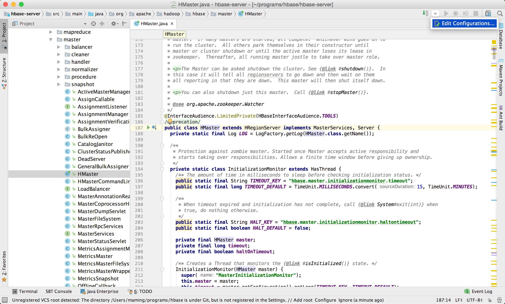
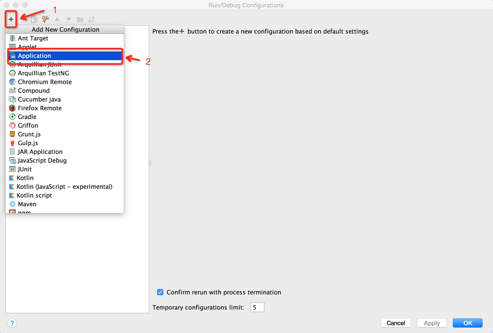
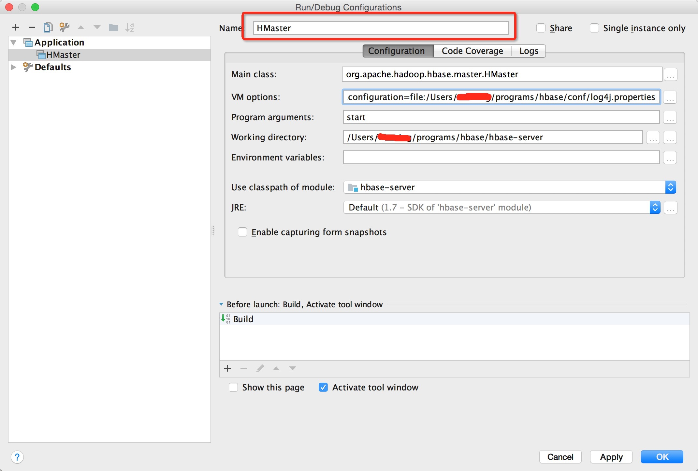
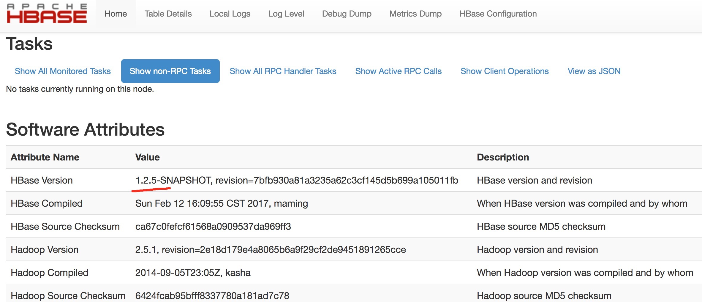
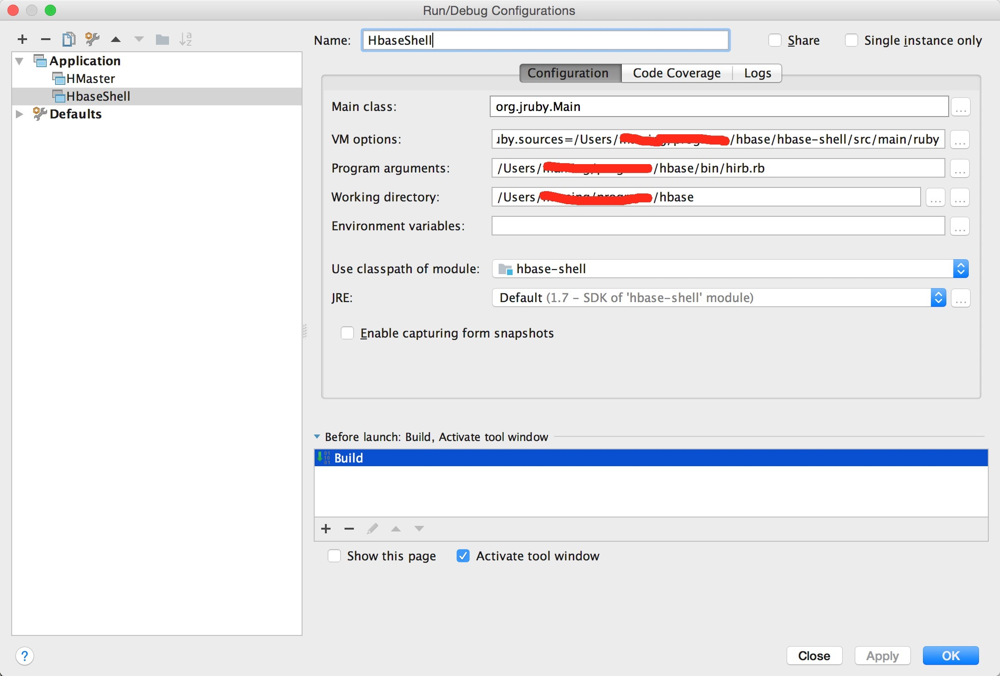
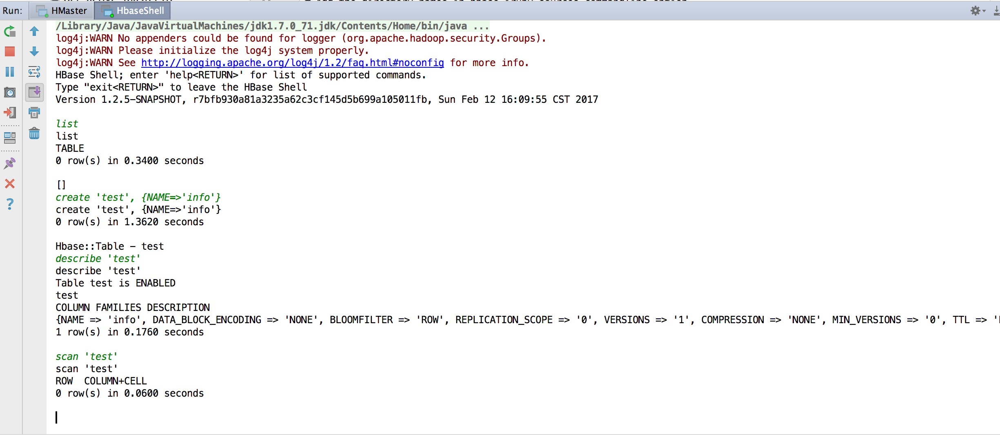

# 编译 HBase 源码

由于本人使用的HBase 版本为 1.2，所以这里以 branch-1.2 做为例子，其他版本类推。IDE 为 IntelliJ IDEA。

## HBase-server 
过程如下：
```
> git clone git@github.com:apache/hbase.git
> cd hbase
# 切换到1.2分支
> git checkout branch-1.2
> mvn clean install -DskipTests
```
1.2 版本默认对应的 Hadoop 版本为 2.5.1，若需要修改为其他版本，可使用命令: `mvn clean install -Denforcer.skip=true -Dhadoop-two.version=2.7.2 -DskipTests -Prelease`。编译完成后，接着在 IntelliJ 中导入源码：选择 File --> New --> Project From Existing Sources...，选择hbase导入。导入后，选择 Edit Configurations，如下图：



接着新建 Application，如下：



配置 Application：



配置 Applicaiton Name 为 HMaster（任意名），设置 Main class 为`org.apache.hadoop.hbase.master.HMaster`，Program arguments 为 `start`，VM options 设置下log， 为 `-Dlog4j.configuration=file:/<YOUR-PATH>/hbase/conf/log4j.properties`。点击 Apply 和 OK。

设置Application后，点击运行即可。 运行HMaster，端口为16010，而非60010。在浏览器中输入 http://localhost:16010 ，即可看到页面如下：



若启动过程HMaster过程中报错如下：
```
java.lang.RuntimeException: hbase-default.xml file seems to be for an older version of HBase (@@@VERSION@@@), this version is 1.2.5-SNAPSHOT
    at org.apache.hadoop.hbase.HBaseConfiguration.checkDefaultsVersion(HBaseConfiguration.java:71)
    at org.apache.hadoop.hbase.HBaseConfiguration.addHbaseResources(HBaseConfiguration.java:81)
    at org.apache.hadoop.hbase.HBaseConfiguration.create(HBaseConfiguration.java:96)
    at org.apache.hadoop.hbase.util.ServerCommandLine.doMain(ServerCommandLine.java:126)
    at org.apache.hadoop.hbase.master.HMaster.main(HMaster.java:2485)
    at sun.reflect.NativeMethodAccessorImpl.invoke0(Native Method)
    at sun.reflect.NativeMethodAccessorImpl.invoke(NativeMethodAccessorImpl.java:57)
    at sun.reflect.DelegatingMethodAccessorImpl.invoke(DelegatingMethodAccessorImpl.java:43)
    at java.lang.reflect.Method.invoke(Method.java:606)
    at com.intellij.rt.execution.application.AppMain.main(AppMain.java:147)
``` 

则先将 hbase/hbase-common/src/main/resource/hbase-default.xml 中的 `hbase.defaults.for.version.skip` 属性设置为 `true`，然后再启动即可。

## HBase Shell
启动 HMaser，接下来编译 HBase Shell。点击 Edit Configurations...，新建Application，在 Name 栏写：HBaseShell（或其他），Main class 填 `org.jruby.Main`, Program arguments 填 hbase/bin/hirb.rb，根据 hbase/bin/hirb.rb，知其需要传递参数 `hbase.ruby.sources`，因此 VM options 填 `-Dhbase.ruby.sources=/<YOUR-PATH>/hbase/hbase-shell/src/main/ruby`。如下图：



点击 Apply 和 OK。

运行 HBaseShell，即可输入相关 hbase shell 命令，如下图：




## 参考
- [Building and Developing Apache HBase](https://github.com/apache/hbase/blob/7294931e622e6e8f4b3a9e88acba84d837660c16/src/main/asciidoc/_chapters/developer.adoc#build)
- [How-to: Create an IntelliJ IDEA Project for Apache Hadoop](http://blog.cloudera.com/blog/2014/06/how-to-create-an-intellij-idea-project-for-apache-hadoop/)
- [PHOENIX-1411](https://issues.apache.org/jira/browse/PHOENIX-1411)

