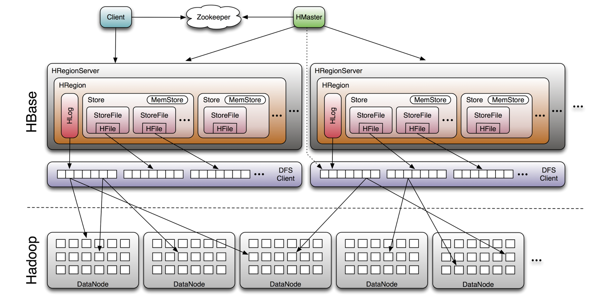

# HBase Architecture

## Overview
HBase有如下特性：

- 强一致性
- 自动分片
- RegionServer 自动故障转移
- 整合Hadoop/HDFS
- 支持MapReduce
- 提供Java Client API
- 提供Thrift/REST API
- Block Cache 和 Bloom Filter
- 便于管理

## HBase的强一致性
> [CAP定理](https://zh.wikipedia.org/wiki/CAP%E5%AE%9A%E7%90%86)指出对于一个分布式系统而言，不可能同时满足以下三点：
- 一致性（Consistence）
- 可用性（Availability）
- 网络分区容忍性（Partition tolerance）
>
> 对于分布式系统而言，分区容忍性是基本要求，所以在设计分布式数据系统时，需要在一致性和可用性中做权衡，但无论如何做权衡，都无法完全放弃一致性，如果真的放弃一致性，那么这个系统中的数据就变得不可信了。一般而言，分布式数据系统会牺牲部分一致性，使用最终一致性。
>
> 常见的一致性类型有：
> - 强一致性：当更新操作完成后，之后任意进程任何时间的请求的返回值都是一致的。
> - 弱一致性：更新完成后，系统并不保证后续请求的返回值是一致的（更新前和更新后的值都可能被返回），也不保证过多久返回的值一致。
> - 最终一致性：更新完成后，在“不一致窗口”后的请求的返回值都是一致。最终一致性是弱一致性的特例。
>

- HBase是怎样保证强一致性的呢？
  - 每个值只出现在一个region。
  - 同一时间每个region只被分配给一个region server。
  - 所有行内的mutation操作都是原子操作。
  - 通过任何API返回的行的内容总是一个完整的行。
- HBase有哪几种一致性？
  - timeline 
  - strong
- hbase 建表时指定的复制备份是啥意思？和hfds备份数为3有啥关系?
- hbase强一致性与hdfs复制3份的关系。

## Architecture
引用的一张图：



每个HRegionServer共享一个WAL，HRegionServer有一个或多个Region构成，每个Region下又有一个或多个Store，每个表的列族对应一个Store实例，每个Store包括一个或多个StoreFile实例，StoreFile为HBase实际存储文件HFile的封装，每个Store对应一个MemStore。HFile由多个Block组成。

```
Table       (HBase table)
    Region       (Regions for the table)
         Store          (Store per ColumnFamily for each Region for the table)
              MemStore           (MemStore for each Store for each Region for the table)
              StoreFile          (StoreFiles for each Store for each Region for the table)
                    Block             (Blocks within a StoreFile within a Store for each Region for the table)
```

## Zookeeper

## 读写


## Reference
- [Apache HBase ™ Reference Guide](http://hbase.apache.org/book.htm)
- [Consistency](https://hbase.apache.org/apidocs/org/apache/hadoop/hbase/client/Consistency.html)
- [HBase: How does replication work](http://stackoverflow.com/questions/5417574/hbase-how-does-replication-work)
- [HBase Read Replicas](http://www.cloudera.com/documentation/enterprise/5-4-x/topics/admin_hbase_read_replicas.html)
- [HBase Read High Availability Using Timeline Consistent Region Replicas](http://www.slideshare.net/enissoz/hbase-high-availability-for-reads-with-time)
- [What are HBase znodes](http://blog.cloudera.com/blog/2013/10/what-are-hbase-znodes/)
