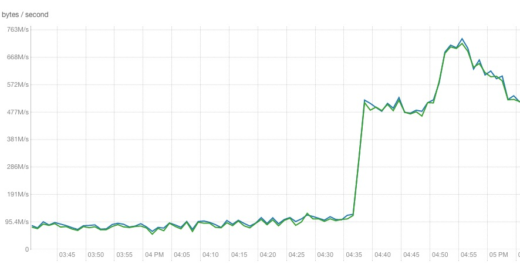
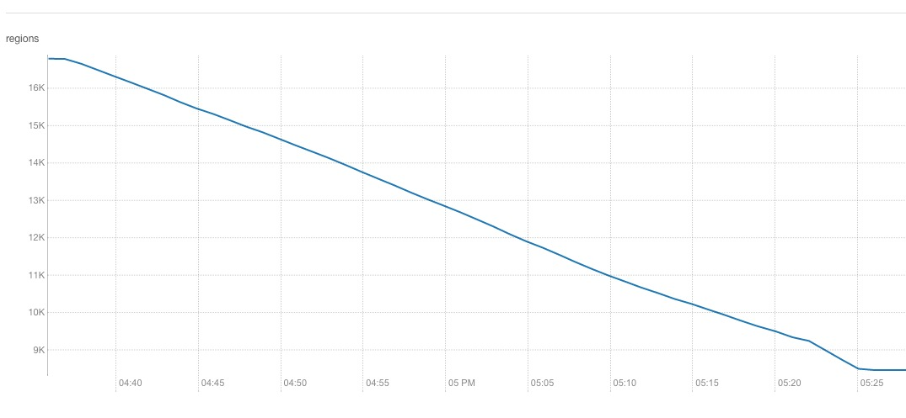

# HBase Merge介绍

_说明：HBase版本: 0.98.1-cdh5.1.4。_

## 背景
之前HBase中有张表原始数据大小为40多T（3备后达到120T），存储时间为180天，和业务方讨论后，可将存储时间调整为90天。另外，由于表未开启压缩，在调整表存储时间时，顺便添加了snappy压缩。经过这2个操作后，表原始大小降为4T。表大小问题解决了，但Region数还非常多，仍为16000多个。由于compact针对的是Region内的StoreFile文件，而HBase不会自动合并小Region文件，所以还需要手动合并这些小Region文件。

查看HDFS上该表的Region大小，基本为100M ~ 1G之间，HBase中设置的`hbase.hregion.max.filesize`为默认值10G，目标值是将Region合并到8G左右，即将邻近的8个Region可合并成1个Region，Region数将缩减到2000个。

## Online Merge
HBase提供了`merge_region`用于合并两个或多个region。命令格式为：
```
hbase> merge_region 'ENCODED_REGIONNAME', 'ENCODED_REGIONNAME'
```

一般而言，为避免空洞，总是合并相邻的两个Region，若需要强制合并不相邻的Region，命令为：

```
hbase> merge_region 'ENCODED_REGIONNAME', 'ENCODED_REGIONNAME', true
```

相邻的Region可通过 `http://<hmaster>:60010/table.jsp?name=<tableName>` 查看。

如：

<pre>
Name								Region Server	Start Key	End Key		Requests
test_log,,1470393748259.9d94fd501cdde185706d973efd72ad14.	dn001:60020			10000		0
test_log,10000,1444717329683.5f9447eca0b365bc0f751ea7ae01c9dd.	dn002:60020	10000		20000		0
test_log,20000,1470393744988.aa6f87b1098919eda3a8c0b649d25b88.	dn003:60020	20000				0
</pre>

Region Name格式为`<table>,<start key>,<timestamp>.<encoded RegionName>`。

## 测试

进入`hbase shell`，执行`merge_region '9d94fd501cdde185706d973efd72ad14', '5f9447eca0b365bc0f751ea7ae01c9dd'`，可以看到这两个Region合并成一个新的Region，如下：
```
Name								Region Server	Start Key	End Key		Requests
test_log,,1470393748259.c69ee1685bba055a47b5529def94c40d.	dn001:60020			20000		0
test_log,20000,1470393744988.aa6f87b1098919eda3a8c0b649d25b88.	dn003:60020	20000				0
```

在HMaster的log有，可以看到如下log：
```
2016-11-15 15:32:05,874 INFO org.apache.hadoop.hbase.master.handler.DispatchMergingRegionHandler: Moving regions to same server for merge: hri=test_log,10000,1444717329683.5f9447eca0b365bc0f751ea7ae01c9dd., src=dn002,60020,1473648788499, dest=dn001,60020,1473648788630
...
...
2016-11-15 15:32:06,316 INFO org.apache.hadoop.hbase.master.AssignmentManager: Handled MERGED event; merged=test_log,,1470393748259.c69ee1685bba055a47b5529def94c40d., region_a=test_log,,1470393748259.9d94fd501cdde185706d973efd72ad14., region_b=test_log,10000,1444717329683.5f9447eca0b365bc0f751ea7ae01c9dd., on dn001
```

## merge qualifier
一般而言，按如上操作继续merge相邻的region就行了。但可能再次执行`merge_online`时会报如下错误：
```
2016-11-15 15:35:31,128 INFO org.apache.hadoop.hbase.master.handler.DispatchMergingRegionHandler: Skip merging regions test_log,,1470393748259.c69ee1685bba055a47b5529def94c40d., test_log,20000,1470393744988.aa6f87b1098919eda3a8c0b649d25b88., because region c69ee1685bba055a47b5529def94c40d has merge qualifier
```

查看[DispatchMergingRegionHandler.java](https://github.com/apache/hbase/blob/0.98/hbase-server/src/main/java/org/apache/hadoop/hbase/master/handler/DispatchMergingRegionHandler.java#L73)，如下:

```
@Override
public void process() throws IOException {
  boolean regionAHasMergeQualifier = !catalogJanitor.cleanMergeQualifier(region_a);
  if (regionAHasMergeQualifier
      || !catalogJanitor.cleanMergeQualifier(region_b)) {
    LOG.info("Skip merging regions " + region_a.getRegionNameAsString()
        + ", " + region_b.getRegionNameAsString() + ", because region "
        + (regionAHasMergeQualifier ? region_a.getEncodedName() : region_b
            .getEncodedName()) + " has merge qualifier");
    return;
  }
  ...
}
```
由代码知是`catalogJanitor`对象的`cleanMergeQualifier()`方法返回false时会报 has merger qualifier 的错误。

而[CatalogJanitor.java](https://github.com/apache/hbase/blob/0.98/hbase-server/src/main/java/org/apache/hadoop/hbase/master/CatalogJanitor.java#L422)代码如下：
```
  public boolean cleanMergeQualifier(final HRegionInfo region)
      throws IOException {
    // Get merge regions if it is a merged region and already has merge
    // qualifier
    Pair<HRegionInfo, HRegionInfo> mergeRegions = MetaReader
        .getRegionsFromMergeQualifier(this.services.getCatalogTracker(),
            region.getRegionName());
    if (mergeRegions == null
        || (mergeRegions.getFirst() == null && mergeRegions.getSecond() == null)) {
      // It doesn't have merge qualifier, no need to clean
      return true;
    }
    // It shouldn't happen, we must insert/delete these two qualifiers together
    if (mergeRegions.getFirst() == null || mergeRegions.getSecond() == null) {
      LOG.error("Merged region " + region.getRegionNameAsString()
          + " has only one merge qualifier in META.");
      return false;
    }
    return cleanMergeRegion(region, mergeRegions.getFirst(),
        mergeRegions.getSecond());
  }
```

由于日志中没有出现 has only one merge qualifier in META 等字段，说明是`cleanMergeRegion()`返回了false，[cleanMergeRegion](https://github.com/apache/hbase/blob/0.98/hbase-server/src/main/java/org/apache/hadoop/hbase/master/CatalogJanitor.java#L187)代码如下：
```

  /**
   * If merged region no longer holds reference to the merge regions, archive
   * merge region on hdfs and perform deleting references in hbase:meta
   * @param mergedRegion
   * @param regionA
   * @param regionB
   * @return true if we delete references in merged region on hbase:meta and archive
   *         the files on the file system
   * @throws IOException
   */
  boolean cleanMergeRegion(final HRegionInfo mergedRegion,
      final HRegionInfo regionA, final HRegionInfo regionB) throws IOException {
    FileSystem fs = this.services.getMasterFileSystem().getFileSystem();
    Path rootdir = this.services.getMasterFileSystem().getRootDir();
    Path tabledir = FSUtils.getTableDir(rootdir, mergedRegion.getTable());
    HTableDescriptor htd = getTableDescriptor(mergedRegion.getTable());
    HRegionFileSystem regionFs = null;
    try {
      regionFs = HRegionFileSystem.openRegionFromFileSystem(
          this.services.getConfiguration(), fs, tabledir, mergedRegion, true);
    } catch (IOException e) {
      LOG.warn("Merged region does not exist: " + mergedRegion.getEncodedName());
    }
    if (regionFs == null || !regionFs.hasReferences(htd)) {
      LOG.debug("Deleting region " + regionA.getRegionNameAsString() + " and "
          + regionB.getRegionNameAsString()
          + " from fs because merged region no longer holds references");
      HFileArchiver.archiveRegion(this.services.getConfiguration(), fs, regionA);
      HFileArchiver.archiveRegion(this.services.getConfiguration(), fs, regionB);
      MetaEditor.deleteMergeQualifiers(server.getCatalogTracker(), mergedRegion);
      services.getServerManager().removeRegion(regionA);
      services.getServerManager().removeRegion(regionB);
      return true;
    }
    return false;
  }
```
从代码中可以看出返回false的条件是该region还存在且其引用文件也存在。查看hdfs上该region目录下，reference文件（regionName/CFName/xxxx.xxxx文件）依然存在。这个也可以通过`hbase hbck`来验证。

理论上讲，每隔5分钟(由`hbase.catalogjanitor.interval`设置)，CatalogJanitor都会检查 .META.，若有无用的region，会将其删除，合并后的region目录下相应的引用文件也会删除。这样合并后的region可再次和其他region合并。CatalogJanitor运行时日志如下：
```
2016-11-15 16:33:29,297 INFO org.apache.hadoop.hbase.master.CatalogJanitor: Scanned 17064 catalog row(s), gc'd 1 unreferenced merged region(s) and 0 unreferenced parent region(s)
2016-11-15 16:43:29,283 INFO org.apache.hadoop.hbase.catalog.MetaEditor: Deleted references in merged region test_log,,1470393748259.c69ee1685bba055a47b5529def94c40d., qualifier=mergeA and qualifier=mergeB
```

也可在shell手动触发CatalogJanitor，相关例如如下：
```
hbase(main):040:0> catalogjanitor_switch true
true
0 row(s) in 0.0020 seconds

hbase(main):041:0> catalogjanitor_run
0 row(s) in 1.1480 seconds
```

## 批量merge
对于16000多个Region，手动去merge显然是不现实的，以下是我写的一个程序用于merge大量region（每次运行合并减少一半Region）。注意，在merge过程中，会造成大量网络I/O和磁盘I/O，降低读性能，并可能会阻塞写，因此最好在业务低峰期merge。

```java
import java.util.List;
import java.util.Collections;
import java.util.Comparator;

import org.apache.hadoop.conf.Configuration;
import org.apache.hadoop.hbase.HBaseConfiguration;
import org.apache.hadoop.hbase.HRegionInfo;
import org.apache.hadoop.hbase.TableName;
import org.apache.hadoop.hbase.client.HBaseAdmin;
import org.apache.hadoop.hbase.util.Bytes;

public class MergeRegion {

    public static void main(String[] args) {
        Configuration conf = HBaseConfiguration.create();
        conf.set("hbase.master", "IP:60000");
        conf.set("hbase.zookeeper.quorum", "ZookServerIp");
        
        try {
            HBaseAdmin admin = new HBaseAdmin(conf);
            List<HRegionInfo> regions = admin.getTableRegions(TableName.valueOf("TABLE"));
            Collections.sort(regions, new Comparator<HRegionInfo>() {
                public int compare(HRegionInfo r1, HRegionInfo r2) {
                    return Bytes.compareTo(r1.getStartKey(), r2.getStartKey());
                }
            });

            HRegionInfo preRegion = null;
            for(HRegionInfo r: regions) {
                int index = regions.indexOf(r);
                if(index%2 == 0) {
                    preRegion = r;
                } else {
                    admin.mergeRegions(preRegion.getEncodedNameAsBytes(), r.getEncodedNameAsBytes(), false);
                }
            }
        } catch (Exception e) {
            e.printStackTrace();
        }
    }
}
```

效果如下：

Network I/O


Region Number


## 参考
- [HBASE-8189](https://issues.apache.org/jira/browse/HBASE-8189)
- [HBase Online Merge](https://www.cloudera.com/documentation/enterprise/5-7-x/topics/cdh_ig_hbase_online_merge.html)
- [HBASE-4255](https://issues.apache.org/jira/browse/HBASE-4255)

