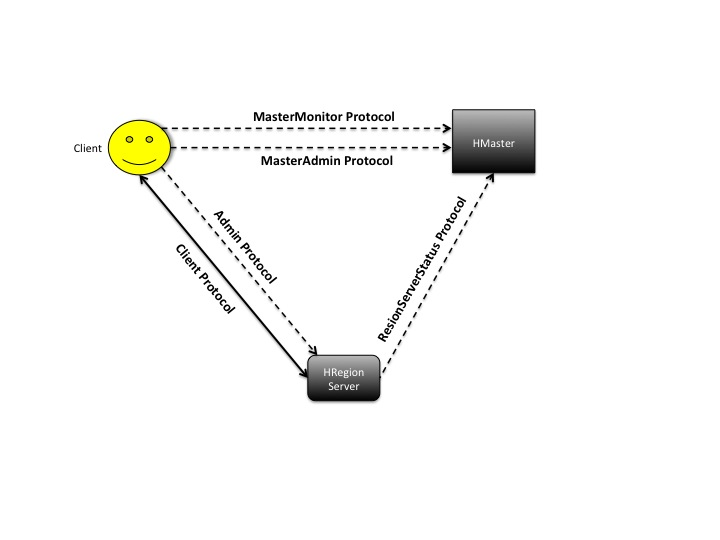

# HBase	RPC 分析

HBase RPC 的实现基于 Hadoop RPC，都是基于 Protobuf 和 NIO 这两个组件。HMaster, RegionServer, Client 间通信使用不同的 RPC 接口，这里先简单分析下 HMaster 与 Client 之间的 RPC 通信实现。如下图：



*图片来自[Protocol Buffers in HBase](http://blog.zahoor.in/2012/08/protocol-buffers-in-hbase/)*

HMaster 端通过 RpcServer 构建 ServerSocket，Client 端使用 RpcClient 构建与服务端通信的 Socket。

## RpcServer 

在 RpcServer [start()](https://github.com/apache/hbase/blob/branch-1.2/hbase-server/src/main/java/org/apache/hadoop/hbase/ipc/RpcServer.java#L2128) 方法中，可以看到 RpcServer 主要启动 Listener, Scheduler, Responder 3 个组件，各组件功能如下：

- Listener    
  负责监听客户端请求。Listener 的 Executor 中有固定数量的 Reader，默认为 10。Listener 以轮询的方式选择 Reader 处理请求，并封装成一个 Call 对象，Call 对象再被包裹到 CallRunner 中被传递给 Scheduler 执行。然后 Reader 返回返回是否还有新的请求需要处理，依次循环。     
- Scheduler     
  Scheduler 有多种实现，默认的 scheduler 实现分配给若干 queue 一些 handler，这些 handler 调用 CallRunner.run() 执行 Call，处理请求结束后，要求 Call 对象进入一个新的 queue 中，该 queue 用于 Responder 获取结果并返回给 client。     
- Responder   
  返回结果给客户端。
       
### Linstener
- [Listener](https://github.com/apache/hbase/blob/branch-1.2/hbase-server/src/main/java/org/apache/hadoop/hbase/ipc/RpcServer.java#L562) 主要封装了一个 ServerSocketChannel 和多个 Reader 线程，同时其还会清理空闲连接。ServerSocket 主要监听客户端请求，对于来不及处理的请求会先暂存于等待队列中，等待队列长度由 `hbase.ipc.server.listen.queue.size` 设置，默认为 128；对于监听到的 Client 的连接，Listener 默认开启 10 个 Reader 线程以[轮转](https://github.com/apache/hbase/blob/branch-1.2/hbase-server/src/main/java/org/apache/hadoop/hbase/ipc/RpcServer.java#L902)的方式处理 Client 端的请求，Reader 个数由参数 `hbase.ipc.server.read.threadpool.size` 设置。         
- 每个 Reader 对象都有一个 Selector，处理 Client 请求时，将拿到相应的 channel 对象并将该对象封装成 Connection 对象再加入到 ConnectionList 中，使用变量 numConnections 标记 Connection 数。        
- 接着 Reader 对象中 doRead 方法再调用 [readAndProcess](https://github.com/apache/hbase/blob/branch-1.2/hbase-server/src/main/java/org/apache/hadoop/hbase/ipc/RpcServer.java#L1554) 方法读取 Connection 对象中的数据。对于新建的 Connection 对象，Reader 会再调用 [readPreamble](https://github.com/apache/hbase/blob/branch-1.2/hbase-server/src/main/java/org/apache/hadoop/hbase/ipc/RpcServer.java#L1482) 方法读取 Connection 对象的 RPC_HEADER，若开头为 `HBas`，则读取接下来的 2 个字节，分别为 verstion 和 auth 方法，若 version 为 0，且 auth 不为 null（应为80、81、82 中的某一值，分别对应 SIMPLE, KERBEROS, DIGEST 谁)，则说明 Connection 合法。    
- 接下来 raadAndProcess 方法中调用 process(), [process()](https://github.com/apache/hbase/blob/branch-1.2/hbase-server/src/main/java/org/apache/hadoop/hbase/ipc/RpcServer.java#L1620) 再调用 processOneRpc()。查看 [processOneRpc()](https://github.com/apache/hbase/blob/branch-1.2/hbase-server/src/main/java/org/apache/hadoop/hbase/ipc/RpcServer.java#L1781)，若为新的 connetcion 对象，则调用 processConnectionHeader() 方法先分析 connectionHeader，否则调用 processRequest() 直接分析请求。[ConnectionHeader](https://github.com/apache/hbase/blob/branch-1.2/hbase-protocol/src/main/protobuf/RPC.proto#L80) 结构由 protobuf 实现，如下：
```
message ConnectionHeader {
  optional UserInformation user_info = 1;
  optional string service_name = 2;
  // Cell block codec we will use sending over optional cell blocks.  Server throws exception
  // if cannot deal.  Null means no codec'ing going on so we are pb all the time (SLOW!!!)
  optional string cell_block_codec_class = 3;
  // Compressor we will use if cell block is compressed.  Server will throw exception if not supported.
  // Class must implement hadoop's CompressionCodec Interface.  Can't compress if no codec.
  optional string cell_block_compressor_class = 4;
  optional VersionInfo version_info = 5;
}
```
- 若是 processRequest() 分析请求的话，也会分析请求头 [RequestHeader](https://github.com/apache/hbase/blob/branch-1.2/hbase-protocol/src/main/protobuf/RPC.proto#L114)，并将请求封装到 Call 对象中，再封装为 CallRunner 对象转给 scheduler，参考[源码](https://github.com/apache/hbase/blob/branch-1.2/hbase-server/src/main/java/org/apache/hadoop/hbase/ipc/RpcServer.java#L1889)，若 call 处理完成后，将该 call 加入到 Respond 队列中。

Connection 对象：
```
|--------------------------------------------------------------------------------------------------------------------------------------------------------------
|  `HBas`  | <version> | <auth_type> | <ConnectionHeader> | RawVarint32 | <RequestLength> | <RequestHeader> |RawVarint32 | [Option]<Parameter> | [Option]<CellBlock> 
| 4 bytes    1 byte      1 byte      |                    |                   an int                                               
```

### Schduler
如果说 Reader 是 CallRunner 的生产者，则么 Handler 便是消费者。为合理分配 Handler，HBase 提供了两种 RpcScheduler 的实现类：[SimpleRpcScheduler](https://github.com/apache/hbase/blob/branch-1.2/hbase-server/src/main/java/org/apache/hadoop/hbase/ipc/SimpleRpcScheduler.java) 和 [FifoRpcScheduler](https://github.com/apache/hbase/blob/branch-1.2/hbase-server/src/main/java/org/apache/hadoop/hbase/ipc/FifoRpcScheduler.java)，参考 [RSRpcServices](https://github.com/apache/hbase/blob/branch-1.2/hbase-server/src/main/java/org/apache/hadoop/hbase/regionserver/RSRpcServices.java#L895)，知目前 HRegionServer 使用 SimpleRpcScheduler。根据 [HBASE-15994](https://issues.apache.org/jira/browse/HBASE-15994)，在 1.4.0 及 2.0.0 才能配置选择 RpcScheduler。

#### FifoRpcScheduler
基于 ThreadPoolExecutor 线程池，以 FIFO 原则分配 handler 来消费已有的 CallRunner 对象，可用于 HMaster。


#### SimpleRpcScheduler
根据请求类型分配不同 rpcExecutor 上的 Handler 处理 CallRunner。rpcExecutor 组分为：
- callExecutor。主要处理一般读写请求。
- priorityExecutor。处理 admin 请求和 meta 表请求。
- replicationExecutor。处理集群复制请求。

callExecutor 有两种类型：deadline 和 fifo，默认是 deadline。根据不同队列类型设置，callExecutor 实现方式不同，这块源码写的比较清楚：
```
    int maxQueueLength = conf.getInt("hbase.ipc.server.max.callqueue.length",
        handlerCount * RpcServer.DEFAULT_MAX_CALLQUEUE_LENGTH_PER_HANDLER);
    String callQueueType = conf.get("hbase.ipc.server.callqueue.type", "deadline");
    float callqReadShare = conf.getFloat("hbase.ipc.server.callqueue.read.ratio", 0);
    float callqScanShare = conf.getFloat("hbase.ipc.server.callqueue.scan.ratio", 0);
    float callQueuesHandlersFactor = conf.getFloat("hbase.ipc.server.callqueue.handler.factor", 0);
    int numCallQueues = Math.max(1, (int)Math.round("hbase.regionserver.handler.count" * callQueuesHandlersFactor));

    // 如果
    if (numCallQueues > 1 && callqReadShare > 0) {
      // multiple read/write queues
      if (callQueueType.equals("deadline")) {
        CallPriorityComparator callPriority = new CallPriorityComparator(conf, this.priority);
        callExecutor = new RWQueueRpcExecutor("RW.default", handlerCount, numCallQueues,
            callqReadShare, callqScanShare, maxQueueLength, conf, abortable,
            BoundedPriorityBlockingQueue.class, callPriority);
      } else {
        callExecutor = new RWQueueRpcExecutor("RW.default", handlerCount, numCallQueues,
          callqReadShare, callqScanShare, maxQueueLength, conf, abortable);
      }
    } else {
      // multiple queues
      if (callQueueType.equals("deadline")) {
        CallPriorityComparator callPriority = new CallPriorityComparator(conf, this.priority);
        callExecutor = new BalancedQueueRpcExecutor("B.default", handlerCount, numCallQueues,
          conf, abortable, BoundedPriorityBlockingQueue.class, maxQueueLength, callPriority);
      } else {
        callExecutor = new BalancedQueueRpcExecutor("B.default", handlerCount,
            numCallQueues, maxQueueLength, conf, abortable);
      }
    }

    // Create 2 queues to help priorityExecutor be more scalable.
    this.priorityExecutor = priorityHandlerCount > 0 ?
        new BalancedQueueRpcExecutor("Priority", priorityHandlerCount, 2, maxQueueLength) : null;

    this.replicationExecutor =
     replicationHandlerCount > 0 ? new BalancedQueueRpcExecutor("Replication",
       replicationHandlerCount, 1, maxQueueLength, conf, abortable) : null;
   }
```
根据 `"hbase.ipc.server.callqueue.handler.factor" * "hbase.regionserver.handler.count"` 的值，callExecutor 可分为多个队列。若设置读写使用不同队列，则使用 RWQueueRpcExecutor，该 rpcExecutor 可将读写分开，并根据设置的 scan 比例，将 scan 与 get 进行分离。若未设置读写分开，则使用 BalancedQueueRpcExecutor，此时也能有多个队列，不过每个队列中同时能有读写请求。

FifoRpcScheduler 和 SimpleRpcScheduler handler 线程池大小均由 `hbase.ipc.server.max.callqueue.length` 控制。若该值未设置的话：
- 对于 HMaster，线程池大小为 `10 * hbase.master.handler.count`，其中 `hbase.master.handler.count`（Master 中的 handlerCount） 默认值为 25；
- 对于 RegionServer, 线程池大小为 `10 * hbase.regionserver.handler.count`，其中 `hbase.regionserver.handler.count`（即 handlerCount） 默认值为 30；
- 对于 [Meta 请求](https://github.com/apache/hbase/blob/branch-1.2/hbase-server/src/main/java/org/apache/hadoop/hbase/regionserver/SimpleRpcSchedulerFactory.java#L49)，线程池大小为 `10 * hbase.regionserver.handler.count`，同 RegionServer，见上面代码。priorityHandlerCount 为 `hbase.regionserver.metahandler.count`， 默认值为 20；
- 对于复制请求，线程池大小为 `10 * hbase.regionserver.handler.count`，同 RegionServer。replicationHandler 个数为 `hbase.regionserver.replication.handler.count`， 默认值为3。

### Response 
Response 负表将服务端的处理结果返回给客户端。从[代码](https://github.com/apache/hbase/blob/branch-1.2/hbase-server/src/main/java/org/apache/hadoop/hbase/ipc/RpcServer.java#L455)中可以看出，response 由 Totalsize, Header, Result, cellBlock 构成。


## Pluggable RpcServer
在 2.0.0 的版本中，可引入 netty 做为 rpc server，参考 [HBASE-15756](https://issues.apache.org/jira/browse/HBASE-15756)。

## 参考
- [RPC通信功能实现](http://blog.csdn.net/JavaMan_chen/article/details/47039517)
- [Protocol Buffers in HBase](http://blog.zahoor.in/2012/08/protocol-buffers-in-hbase/)
