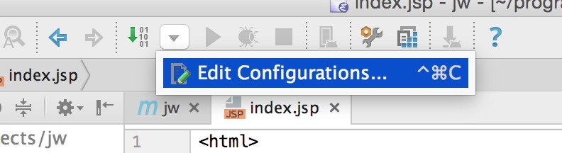
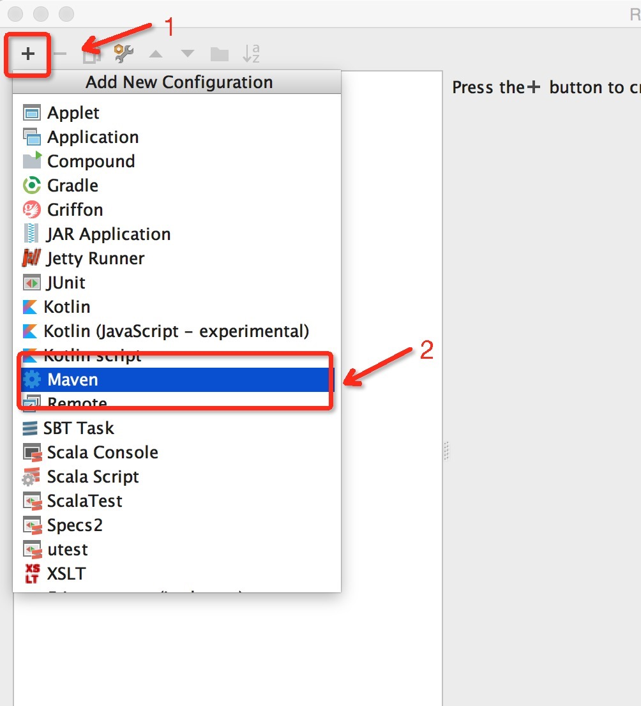
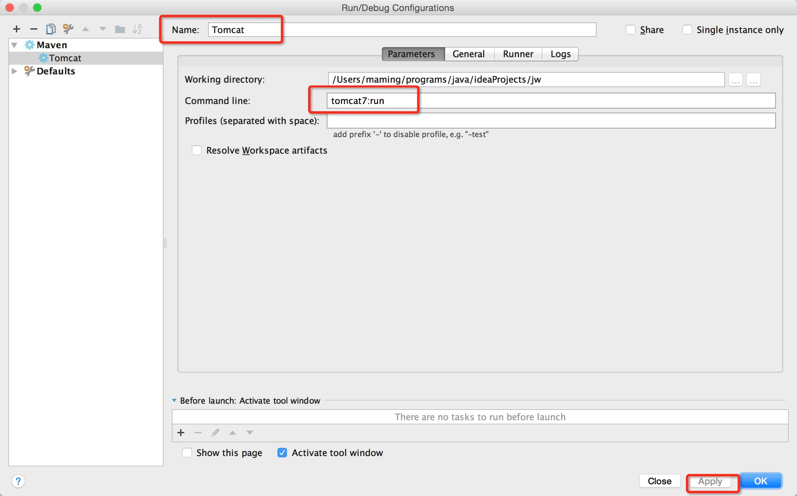

# IntelliJ IDEA

## IntelliJ Community 集成 Tomcat
Ultimate版下载Tomcat and TomEE插件安装即可，但Community版并没有该插件。若需要使用Web Server，可以使用Jetty或Maven运行的Tomcat。以下简单介绍下如何配置Maven运行的tomcat。

- 新建项目，如下：


- 修改pom.xml，添加如下行：
```
<build>
    <finalName><YOUR PROJECT NAME></finalName>
    <plugins>
      <plugin>
        <groupId>org.apache.tomcat.maven</groupId>
        <artifactId>tomcat7-maven-plugin</artifactId>
        <version>2.2</version>
        <configuration>
          <port>9090</port>
          <path>/</path>
          <uriEncoding>UTF-8</uriEncoding>
          <server>tomcat7</server>
        </configuration>
      </plugin>
    </plugins>
</build>
```

- 点击Edit Configurations，添加Maven配置。



- 编辑该Maven配置


Tomcat Goal可参考[Plugin Documentation](http://tomcat.apache.org/maven-plugin-2.2/tomcat7-maven-plugin/plugin-info.html)，这里选择`tomcat7:run`。

- 运行该Tomcat，打开http://localhost:9090，可以看到"Hello World!"字样。

ps: Community相比Ultimate功能缺失有点多了，不过Ultimate价格又有点贵了-,-

## 快捷方式
### 快捷键

  功能      |  快捷键
------------|----------------


### 快捷方法
输入快捷方法后，再按TAB键即显示相关Java代码。

  Java代码            | 快捷方法        
----------------------|----------------
 System.out.println   |  sout           


另外，可通过`Live Templates`功能，构建相关快捷方式，如构建main方法：
```
public static void main(String[] args) {

}
``
