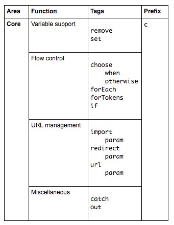
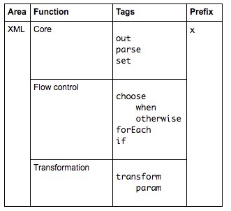
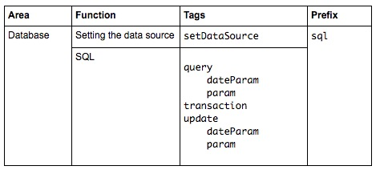
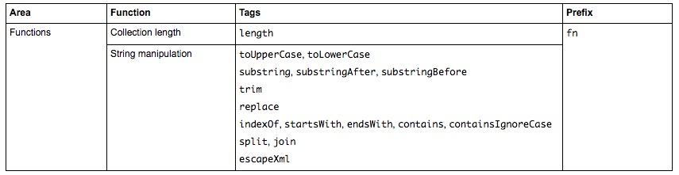

## JSP简介

注：本来想翻下Oracle关于JSP的文档，结果只在JavaEE5中找到了相关文档，JavaEE6/7均未发现JSP文档，在JavaEE7的[Introduction to Facelets](https://docs.oracle.com/javaee/7/tutorial/jsf-facelets.htm#GIEPX)发现如下一段文字：
> The term Facelets refers to the view declaration language for JavaServer Faces technology. Facelets is a part of the JavaServer Faces specification and also the preferred presentation technology for building JavaServer Faces technology–based applications. JavaServer Pages (JSP) technology, previously used as the presentation technology for JavaServer Faces, does not support all the new features available in JavaServer Faces in the Java EE 7 platform. JSP technology is considered to be a deprecated presentation technology for JavaServer Faces.

可以看到，JSP由于不支持JSF的部分新特性，后续将被Facelet代替。不过这里还是以JavaEE5为参考，简单的记录下相关知识。关于JSP的更多讨论，可参考[Where's the official JSP tutorial](http://stackoverflow.com/questions/4845032/wheres-the-official-jsp-tutorial)。

### 语法
JSP元素能以两种形式表达：标准语法和XML语法。其中标准语法可参考[JavaServer Pages Standard Tag Library](http://docs.oracle.com/javaee/5/tutorial/doc/bnakc.html)和[Scripting in JSP Pages](http://docs.oracle.com/javaee/5/tutorial/doc/bnaon.html)，XML语法可参考[JavaServer Pages Documents](http://docs.oracle.com/javaee/5/tutorial/doc/bnajo.html)，以下是一些常见表示方法：

语法元素 |  标准语法   |  XML语法
---------|-------------|----------------
注释     | <%-- .. --%> | <!-- .. -->
定义类，方法，变量等    | <%! .. %> | <jsp:declaration> .. </jsp:declaration>
表达式   | <%= .. %>  | <jsp:expression> .. </jsp:expression>
代码片断   | <% .. %>  | <jsp:scriptlet> .. </jsp:scriptlet>
include指令     | <%@ include .. %> | <jsp:directive.include .. />
page指令     | <%@ page .. %> | <jsp:directive.page .. />
taglib指令     | <%@ taglib .. %> | xmlns:prefix="tag library URL"

### JSP动作元素
如下：

语法 | 说明
-----|-----------
jsp:include | 请求页面时引入一个文件。
jsp:forward | 把请求转到另外一个页面。
jsp:useBean | 查找或实例化一个JavaBean。
jsp:getProperty | 输出JavaBean属性。
jsp:setProperty | 设置JavaBean属性。
jsp:plugin | 根据浏览器类型为Java插件生成标记。
jsp:element | 动态定义XML元素。
jsp:attribute | 设置动态定义的XML元素属性。
jsp:body | 设置动态定义的XML元素内容。
jsp:text | 在JSP页面和文档中使用写入文本的模板

### JSP内置对象与属性范围

内置对象如下：

对象   | 类型   |  描述            |   作用域
--------|-----------|---------------|-----------------------------------
request | javax.servlet.http.HttpServletRequest | 用户请求。 | request
response | javax.servlet.http.HttpServletResponse | 服务器端响应。| page
session | javax.servlet.http.HttpSession | 会话信息。 | session
application | javax.servlet.ServletContext | 应用信息，所有用户共享。| application
config | javax.servlet.ServletConfig | 服务器配置。| page
out | javax.servlet.jsp.JspWriter | 页面输出。 | page
page |java.lang.Object | 页面的Servlet实例，类似Java类中的this关键字。| page
pageContext | javax.servlet.jsp.PageContext | JSP的页面容器。|page
exception | java.lang.Throwable | 表示JSP页面的异常。 | page

JSP针对内置对象，提供了4种级别的属性保存范围：
- page： 在一个页面中保存属性。需通过`pageContext`对象调用。
- request：在一次请求中保存属性。需通过`request`对象调用。
- session：在一次会话中保存属性。需通过`session`对象调用。
- application：在整个服务器上保存属性。需通过`application`对象调用。

这四种属性范围都支持如下操作：
```
public void setAttribute(String name, Object value)
public Object getAttribute(String name)
public Object removeAttribute(String name)
```

### EL
为了让JPS编写更加简单，JSP2.0提供了EL表达式，以下简单介绍下。

- 语法结构           
 `${expression}`。
- `[]`与`.`    
  这两种运算符用来取数据。
- 属性范围在EL中的名称       

  属性范围    | EL名称
  ------------|-----------
    page      | pageScope
    request   | requestScope
    session   | sessionScope
    application | applicationScope
  
  在取变量username时，若使用`${username}`，由于未指定哪一个范围的username，因此会依次从page，request，session，application范围查找该变量。

- 内置对象
  EL提供了如下内置对象：
  
  内置对象   |   说明
 ------------|--------------------
  pageContext | JSP页的上下文，用于访问JSP内置对象，如requst, session ,response等。例子：`${pageContext.response}`访问页面的响应对象。
  param      | 表达式`$(param.name)` 相当于`request.getParameter(name)`。
  paramValues | 表达式 `${paramvalues.name)`相当于`request.getParamterValues(name)`。
  header | 表达式 `${header.name}` 相当于`request.getHeader(name)`。
  headerValues | 表达式 `${headerValues.name}` 相当于 `request.getHeaderValues(name)`。
  cookie | 表达式 `${cookie.name.value}` 返回带有特定名称的第一个 cookie 值。  
  initParam | 将上下文初始化参数名称映射到单个值（通过调用 `ServletContext.getInitparameter(String name)` 获得）

### JSTL
JSP标准标签库(JSTL)是一个JSP标签集群，封装了JSP的通用核心功能。根据JSTL提供的功能，其可分为五类：

 功能  |  前缀
 ------|-------
  CORE | c
  XML  | x
  I18N | fmt
  Database | sql
  Functions | fn

#### Core Tag Library

以下是[Core Tag Library](http://docs.oracle.com/javaee/5/tutorial/doc/bnakh.html)中的一个表格，总结了core标签库的用法：



#### XML Tag Libarary



#### Internationalization Tag Library


#### SQL Tag Library


#### Function Tag Library


## 参考
- [JavaServer Pages Technology](http://docs.oracle.com/javaee/5/tutorial/doc/bnagx.html)
- [JavaServer Pages Standard Tag Library](http://docs.oracle.com/javaee/5/tutorial/doc/bnakc.html)


 

