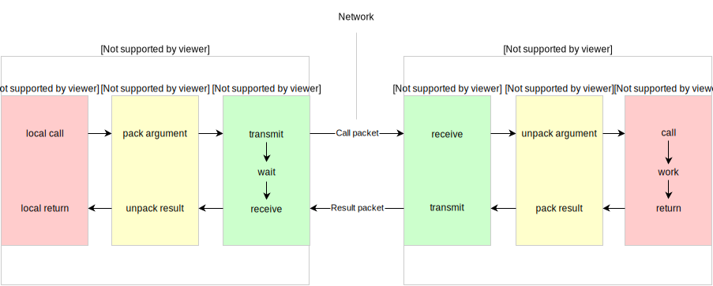

# RPC简介

参考维基百科中的定义，RPC全称为Remote Procedure Call，是一种通信协议，该协议允许程序调用另一计算机的子程序，而无须为这个交互编写额外的代码。即程序员调用本地函数和RPC函数，方法基本相同。

## 目标
做为RPC概念的提出者，Nelson在[Implementing Remote Procedure Calls](http://birrell.org/andrew/papers/ImplementingRPC.pdf)中提出了RPC系统的几个目标：

- 简单   
  RPC应该和本地函数调用一样简单，这样分布式计算会更加容易。
- 高效   
- 安全

考虑到编程语言不一定提供了能表示远程地址的方法，即使提供了远程地址的表示方法，不同计算机间使用共享地址空间的代价也可能大于实际收益，因此RPC舍弃了在不同计算机之前仿真共享地址空间。另外，由于本地方法调用不会出现 timeout 的情况，RPC设计时没有 timeout 方法。

## 结构

Nelson指出实现RPC的程序包括如下5个理论部分：

- user
- user-stub
- RPCRuntime
- server-stub
- server

如图：

## 参考
- [Implementing Remote Procedure Calls](http://birrell.org/andrew/papers/ImplementingRPC.pdf)
- [Remote Procedure Call Programming Guide](https://docs.freebsd.org/44doc/psd/23.rpc/paper.pdf)
- [Remote Procedure Call](https://christophermeiklejohn.com/pl/2016/04/12/rpc.html)
- [RPC 的概念模型与实现解析](http://mindwind.me/blog/2016/05/22/RPC-%E7%9A%84%E6%A6%82%E5%BF%B5%E6%A8%A1%E5%9E%8B%E4%B8%8E%E5%AE%9E%E7%8E%B0%E8%A7%A3%E6%9E%90.html)
