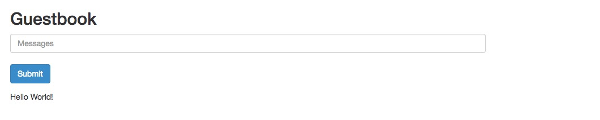

# 使用 k8s 部署 "Hello World" 应用

Kubernetes 搭建完成后，先使用 Kubernetes 部署服务，以对 Kubernetes 有个直观认识。按照 IT 界惯例，这里以 Kubernetes 部署 PHP + Redis 实现的 Hello World 级别的 Web 留言板做为例子。

## 部署应用
### 部署 Redis Master 
创建文件 redis-master.yml，内容如下：
```
apiVersion: extensions/v1beta1
kind: Deployment
metadata:
  name: redis-master
spec:
  replicas: 1
  template:
    metadata:
      labels:
        app: redis
        role: master
        tier: backend
    spec:
      containers:
      - name: master
        image: kubeguide/redis-master
        resources:
          requests:
            cpu: 100m
            memory: 128Mi
          limits:
            memory: 256Mi
            cpu: "0.2"
        ports:
        - containerPort: 6379
---
apiVersion: v1
kind: Service
metadata:
  name: redis-master
  labels:
    app: redis
    role: master
    tier: backend
spec:
  ports:
  - port: 6379
    targetPort: 6379
  selector:
    app: redis
    role: master
    tier: backend
```

上述文件包含了 Deployment 和 Service 两块内容，Deployment 设置 Pod 的具体情况，如复本个数，镜像文件，资源限制，端口分配等；Service 用于将符合条件（基于 selector）的 Pod 统一提供给外界使用。

Service 须设置 selector，通过 selector 的值筛选 label 标记的 Pod，故 `.spec.selector` 需匹配 `.spec.template.metadata.labels`，若 `.spec.selector` 未指定，则 `.spec.selector.matchLabels` 默认等于 `.spec.template.metadata.labels`。

接着使用 `kubectl create -f redis-master.yml` 创建 Deployment 和 Service，执行命令后查看创建的对象如下：
```
$ kubectl get deploy -o wide
NAME           DESIRED   CURRENT   UP-TO-DATE   AVAILABLE   AGE       CONTAINER(S)   IMAGE(S)                           SELECTOR
redis-master   1         1         1            1           21h       master         kubeguide/redis-master             app=redis,role=master,tier=backend
$ kubectl get svc -o wide
NAME           CLUSTER-IP       EXTERNAL-IP   PORT(S)        AGE       SELECTOR
redis-master   10.254.131.185   <none>        6379/TCP       21h       app=redis,role=master,tier=backend
$ kubectl get pod -o wide
NAME                           READY     STATUS    RESTARTS   AGE       IP           NODE
redis-master-374500000-g3jb5   1/1       Running   0          3h        10.10.33.5   svr003
```

### 创建 Redis Slave
新建 redis-slave.yml 文件，内容如下：
```
apiVersion: extensions/v1beta1
kind: Deployment
metadata:
  name: redis-slave
spec:
  replicas: 2
  template:
    metadata:
      labels:
        app: redis
        role: slave
        tier: backend
    spec:
      containers:
      - name: slave
        image: kubeguide/guestbook-redis-slave
        resources:
          requests:
            cpu: 100m
            memory: 128Mi
          limits:
            memory: 256Mi
            cpu: "0.2"
        env:
        - name: GET_HOSTS_FROM
          value: env
        ports:
        - containerPort: 6379
---
apiVersion: v1
kind: Service
metadata:
  name: redis-slave
  labels:
    app: redis
    role: slave
    tier: backend
spec:
  ports:
  - port: 6379
    targetPort: 6379
  selector:
    app: redis
    role: slave
    tier: backend
```

执行 `kubectl create -f redis-slave.yml` 创建 Deployment 和 Service，由于 Redis Master 创建的 IP 是由 Kubernetes 自动分配的，其他 Pod 无法预知某个 Service 的虚拟 IP，对于这种情况，Kubernetes 提供了 ENV 和 DNS 两种方式来解决。由于 DNS 服务还未搭建，因此这里使用 ENV 的方式。使用的 kubeguide 的镜像使用 GET_HOSTS_FROM 来获取 Redis  Master 地址。

如何验证 Redis Slave 是否与 Redis Master 通信成功呢？在启动 Redis Slave 的机器，通过 `sudo docker container` 查看 Redis Slave 对应的镜像 ID，然后使用 `sudo docker logs CONTAINER_ID` 即可查看 Redis Log，Log 中可以看到与 Master 的通信记录。

### 部署 Frontend 服务
新建 frontend.yml 文件，内容如下：
```
apiVersion: extensions/v1beta1
kind: Deployment
metadata:
  name: frontend
spec:
  replicas: 2
  template:
    metadata:
      labels:
        name: frontend
    spec:
      containers:
      - name: frontend
        image: kubeguide/guestbook-php-frontend
        env:
        - name: GET_HOSTS_FROM
          value: env
        ports:
        - containerPort: 80
---
apiVersion: v1
kind: Service
metadata:
  name: frontend
  labels:
    name: frontend
spec:
  selector:
    name: frontend
  type: NodePort
  ports:
  - port: 80
    nodePort: 30001
```

这里对几个端口做下解释：Service 中的 port 即集群内部访问 Service 的端口，nodePort 即集群外部访问 Service 的端口，targetPort 即 Service 内 Pod 使用的端口，其范围为 30000-32767，从 nodePort 和 port 来的数据通过 Pod 上的 targetPort 进入容器。 

执行命令：`kubectl create -f frontend.yml` 创建前端 Deployment 和 Service。现在 Deployment 和 Service 情况如下：
```
$ kubectl get pod -o wide
NAME                           READY     STATUS    RESTARTS   AGE       IP           NODE
frontend-3987651119-5kwgn      1/1       Running   0          2h        10.10.77.3   svr002
frontend-3987651119-r69tz      1/1       Running   0          2h        10.10.33.6   svr003
redis-master-374500000-g3jb5   1/1       Running   0          3h        10.10.33.5   svr003
redis-slave-3098281825-fd3qd   1/1       Running   0          15m       10.10.33.3   svr003
redis-slave-3098281825-thntj   1/1       Running   0          15m       10.10.77.2   svr002
$ kubectl get svc -o wide
NAME           CLUSTER-IP       EXTERNAL-IP   PORT(S)        AGE       SELECTOR
frontend       10.254.136.99    <nodes>       80:30001/TCP   2h        name=frontend
redis-master   10.254.131.185   <none>        6379/TCP       21h       app=redis,role=master,tier=backend
redis-slave    10.254.54.7      <none>        6379/TCP       31m       app=redis,role=slave,tier=backend
$ kubectl get deploy -o wide
NAME           DESIRED   CURRENT   UP-TO-DATE   AVAILABLE   AGE       CONTAINER(S)   IMAGE(S)                           SELECTOR
frontend       2         2         2            2           2h        frontend       kubeguide/guestbook-php-frontend   name=frontend
redis-master   1         1         1            1           21h       master         kubeguide/redis-master             app=redis,role=master,tier=backend
redis-slave    2         2         2            2           31m       slave          kubeguide/guestbook-redis-slave    app=redis,role=slave,tier=backend
```

在浏览器上打开 http://svr002:30001 ，页面如下：



即部署成功。

## 管理服务
若需要设置前端服务个数，执行命令如下：
```
// 增加 frontend pod 个数
$ kubectl scale deployment frontend --replicas=5
deployment "frontend" scaled
$ kubectl get pod -o wide
NAME                           READY     STATUS    RESTARTS   AGE       IP           NODE
frontend-3987651119-197t0      1/1       Running   0          34m       10.10.33.4   svr003
frontend-3987651119-5kwgn      1/1       Running   0          3h        10.10.77.3   svr002
frontend-3987651119-7128s      1/1       Running   0          34m       10.10.77.4   svr002
frontend-3987651119-9wck7      1/1       Running   0          9s        10.10.77.5   svr002
frontend-3987651119-r69tz      1/1       Running   0          3h        10.10.33.6   svr003
redis-master-374500000-g3jb5   1/1       Running   0          4h        10.10.33.5   svr003
redis-slave-3098281825-fd3qd   1/1       Running   0          1h        10.10.33.3   svr003
redis-slave-3098281825-thntj   1/1       Running   0          1h        10.10.77.2   svr002
// 减少 frontend pod 个数
$ kubectl scale deployment frontend --replicas=1
deployment "frontend" scaled
$ kubectl get pod -o wide
NAME                           READY     STATUS    RESTARTS   AGE       IP           NODE
frontend-3987651119-r69tz      1/1       Running   0          3h        10.10.33.6   svr003
redis-master-374500000-g3jb5   1/1       Running   0          4h        10.10.33.5   svr003
redis-slave-3098281825-fd3qd   1/1       Running   0          1h        10.10.33.3   svr003
redis-slave-3098281825-thntj   1/1       Running   0          1h        10.10.77.2   svr002
```

从上可以看到，动态调整 pod 非常方便。相比自己设置环境，调整服务等，Kubernetes 能大大提高效率。

## yml 文件格式说明

使用 `.yml` 文件创建 Kubernetes 对象时，`.yml` 文件须包含如下字段：
- apiVersion - 创建 Kubernetes 对象所使用的 API 版本。
- kind - 创建的对象类型。
- metadata - 用于唯一标识该对象的数据，包括 name，UID（由 Kubernetes 产生）和 namespace（默认为"default"）等。metadata 还有其他[可选字段](https://github.com/kubernetes/community/blob/master/contributors/devel/api-conventions.md#metadata) ，如用于将对象以某种共同属性归类的 labels 字段。
- spec - 用于详细描述对象格式，spec 中各子字段参考所使用的 API。通常会在 spec 中使用 pod template 描述对象，pod template 除了不需要 apiVersion 和 kind 字段外，其余结构同 [pod](https://kubernetes.io/docs/concepts/workloads/pods/pod/) 结构，具体参考[PodTemplate v1 core](https://kubernetes.io/docs/api-reference/v1.7/#podtemplate-v1-core)。

各对象对于 spec 字段要求不一定相同，比如对于 Deployment 对象，spec 字段中唯一需要指定的是 `.spec.template` 子字段。这里先不详细叙述。

## 参考
- [Example: Deploying PHP Guestbook application with Redis](https://kubernetes.io/docs/tutorials/stateless-application/guestbook/#start-up-the-redis-master)
