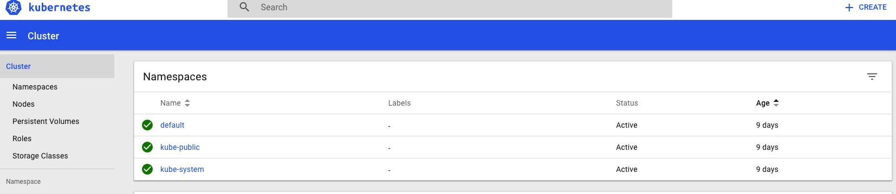

# Kubernetes 简介与安装


## 组件

整体结构如下图:


以下简单介绍下各模块：
### master 组件
- kube-apiserver   
  kube-apiserver 提供了 api 功能，相当于 kubernetes crontrol plane 的前端部分。
- etcd   
  etcd 做为 kubernetes 的后端存储部分，集群所有数据都存放在这里，所以一般而言需备份 etcd 数据。
- kube-controller-manager   
  controller 是处理任务的后台进程，kuber-controller-manager 管理这些 controller。理论上讲每个 controller 都应是一个单独的线程，不过为方便起见，kubernetes 将所有 controller 都放在一个进程中运行。controller 有如下几类：
  - Node Controller: 用来通知并响应何时 node 下线。
  - Replication Controller: 管理 pod 的正确数量。
  - Endpoints Controller: 产生 endpoint 对象。
  - Service Account & Token Controller: 创建账户和 token。
- kube-scheduler    
  给创建的 pod 指定 node。
- flannel  
  网络类型，用于与容器通信。

### node 组件
- kubelet    
  kubelet 是主要的 node 客户端服务，其提供 pod 相关的操作。
- kube-proxy(Kubernetes Proxy)   
  管理 service 的入口，kube-proxy 允许 kubernetes 服务进行网络连接的转发。
- docker   
  用来运行容器。
- flannel     
  设置 docker 网络。

## 安装
### 条件
在正式安装前，确保如下几点满足条件：
- 服务器操作系统版本为 Ubuntu16.04+，CentOS7 或 HypriotOS v1.0.1+
- 每台服务器至少 1GB 内存
- 服务器间网络互通
- 关闭防火墙和 iptables
  命令如下：
  ```
  $ sudo setenforce 0
  $ sudo systemctl disable iptables-services firewalld
  $ sudo systemctl stop iptables-services firewalld
  ``` 
- 各节点时间一致，这点可通过配置 ntp 服务实现。
- 如下端口可用

 Node type | Port | Purpose
-----------|-----------|-----------
 Master    | 6443      | Kubernetes API Server
 Master    | 2379-2380 | etcd Server Client API
 Master/Node    | 10250     | Kubelet API
 Master    | 10251     | kube-scheduler
 Master    | 10252     | kube-controller-manager
 Master/Node      | 10255     | Read-only Kubelet API (Heapster)
 Node      | 30000-32767 | Node 上服务随机使用的端口

本次测试机器角色分配如下：

 Hostname | IP | Role | Components
---------|-----|------|-------
 svr001  | 192.168.100.10 | Master |Flannel, etcd, API Server, Scheduler, Controller Manager
 svr002  | 192.168.100.11 | Node | Flannel, Docker, Kubelet, kube-proxy
 svr003  | 192.168.100.12 | Node | Flannel, Docker, Kubelet, kube-proxy

### 安装步骤
安装 kubernetes 的方式较多，比如官网上使用 kubectl 进行安装；若希望开发或调试 kubernetes，可通过编译安装；使用 kubeadm 可以学习官方在集群配置方面的一些最佳实践，不过该方法目前仍在测试版本中，因此不能用于正式环境使用。这里使用[二进制预编译包](https://github.com/kubernetes/kubernetes/releases)安装。
#### 通用服务
- 安装 kubernetes
在各节点上下载最新版 kubernetes 后解压，如下：
```
$ cd kubernetes/cluster
// 若需设置 proxy 才能访问外网，可先在 get-kube-binaries.sh 中进行设置 export https_proxy=http://SERVER:PROT/
$ ./get-kube-binaries.sh
$ cd ../server
$ tar xvzf kubernetes-server-linux-amd64.tar.gz
$ cd kubernetes/server/bin
$ rm *.tar *_tag
// 这里可以将 kubernetes 组件 owner 置为 root
// $ sudo chown root:root *
$ sudo chmod 755 *
$ sudo cp * /usr/bin
```
- 下载 [flannel](https://github.com/coreos/flannel/releases)，解压后将 flanneld 移动到 /usr/bin 目录下。~~同时将 kubernetes/cluster/centos/node/bin/remove-docker0.sh 移到 /usr/bin 目录下，该脚本用来删除 docker 默认网络，使用 flannel 网络~~。将 [kubernetes systemd](systemd) 中的 flanneld.service 拷贝到 `/usr/lib/systemd/system`。
- 编辑 `/etc/sysconfig/flanneld`，内容如下：
```
FLANNELD_ETCD_ENDPOINTS="http://svr001:2379"
FLANNELD_ETCD_PREFIX="/kube/network"
```
由于默认情况下，flanneld 会读取 etcd 上 `/coreos.com/network/config` 的配置，若想修改该配置，可通过`--etcd-prefix`（即配置中的 `FLANNEL_ETCD_PREFIX`）来覆盖该配置。 


根据角色不同，以下分别叙述 Kubernetes Master 和 Kubernetes Node 上的部署。
#### Kubernetes Master 
- 下载 [etcd](https://github.com/coreos/etcd/releases)，解压后将 etcd, etcdctl 移动到 /usr/bin 目录下。
- 参考[kubernetes systemd](systemd)，将 etcd.service， kube-apiserver.service，kube-controller-manager.service 和 kube-scheduler.service 拷贝到 `/usr/lib/systemd/system` 目录下；将 [kuebernetes conf](etc) 中 config, apiserver 拷贝到 `/etc/kubernetes` 目录下，etcd.conf 拷贝到 `/etc/etcd` 中，并创建文件目录 `/var/lib/etcd/default.etcd`，修改变量 `KUBE_MASTER` 为 Master Hostname（或ip）。各 service 文件中指定启动 user 为 kube，因此还需要做如下操作：
```
$ sudo useradd kube
$ sudo chown -R kube:kube /var/run/kubernetes
```
- 如架构图中所示，启动 etcd, API Server, Scheduler, Controller Manager 等 Master 组件：
```
$ sudo systemctl daemon-reload
$ for SERVICES in etcd kube-apiserver kube-controller-manager kube-scheduler; do
    sudo systemctl restart $SERVICES
    sudo systemctl enable $SERVICES
    sudo systemctl status $SERVICES 
done
```
若 status service 返回：`Active: active (running)`，则启动成功。如果启动失败，通过 `sudo journalctl -xe` 查看原因。

#### Kubernetes Node
- 先安装 Docker，由于 docker 依赖的 `container-selinux` 包在 extras repo 中，因此需要先将该repo开启（默认开启）。执行命令如下：
```
// 开启 extras
$ sudo yum-config-manager --enable extras
$ sudo yum -y install yum-utils device-mapper-persistent-data lvm2
$ sudo yum-config-manager --add-repo https://download.docker.com/linux/centos/docker-ce.repo
$ sudo yum makecache fast
$ sudo yum -y install docker-ce
$ yum list docker-ce.x86_64  --showduplicates | sort -r
$ sudo systemctl start docker
$ sudo docker run hello-world
```
由于使用了 flanneld，若 `/usr/lib/systemd/system/docker.service` 中没使用 flannel 生成的参数，则还需要配置。参考 [systemd](systemd) 中的 docker.service 文件。
若 yum 无法访问外网，可在 /etc/yum.conf 中设置 proxy 代理；若 docker 无法访问外网，参考 [Control and configure Docker with systemd](https://docs.docker.com/engine/admin/systemd/) 设置代理。
- 在 etcd 中配置网络。
执行命令：`etcdctl set /kube/network/config '{"Network": "10.10.0.0/16", "SubnetLen": 24, "Backend": {"Type": "vxlan"}}'`。
flannel 默认 Backend 为 `udp`，[由于 udp 只能用于 debug](https://coreos.com/flannel/docs/latest/backends.html)，所以这里修改为 `vxlan`，另外注意 etcd 中 value 为 JSON 格式。
- 将 [kubernetes systemd](systemd) 中的 kubelet.service 和 kube-proxy.service 拷贝到 `/usr/lib/systemd/system` 目录下，新建目录 `/etc/kubernetes`，将 [kubernetes conf](etc) 中的 config，kubelet，proxy 拷贝到 `/etc/kubernetes` 目录下，修改变量 `KUBE_MASTER` 为 Master Hostname（或ip），修改 kubelet 中 `KUBELET_HOSTNAME` 值。**根据 `kubelet.service` 中设置的 WorkingDirectory，创建对立目录 `/var/lib/kubelet`**。
- 启动服务：
```
$ sudo systemctl daemon-reload
$ for SERVICES in kube-proxy kubelet flanneld docker; do
    sudo systemctl restart $SERVICES
    sudo systemctl enable $SERVICES
    sudo systemctl status $SERVICES
done
```
注：docker 需在 flanneld 启动成功后再启动。
- 各 Node 节点配置 kubectl，如下：
```
$ kubectl config set-cluster default-cluster --server=http://svr001:8080
$ kubectl config set-context default-context --cluster=default-cluster --user=default-admin
$ kubectl config use-context default-context
```
或在用户根目录下，创建 `~/.kube/config`，内容如下：
```
apiVersion: v1
clusters:
- cluster:
    server: http://svr001:8080
  name: default-cluster
contexts:
- context:
    cluster: default-cluster
    user: default-admin
  name: default-context
current-context: default-context
kind: Config
preferences: {}
users: []
```

### 安装 DashBoard
若按照 [官方文档](https://github.com/kubernetes/dashboard) 的方法执行`$ kubectl create -f https://git.io/kube-dashboard`，会因网络问题无法安装成功，所以需要使用其他方法。

由于内网和墙的原因，无法访问镜像 `gcr.io/google_containers/kubernetes-dashboard-amd64:v1.6.3`。在 hub.docker.com 上找了下，有个 dashboard 的[镜像](https://hub.docker.com/r/siriuszg/kubernetes-dashboard-amd64/)。这里使用 v1.6.3，将该镜像上传到本地仓库，方便内网其他服务器访问：
```
$ sudo docker run -d -p 5000:5000 registry  # 运行本地仓库
$ sudo docker pull siriuszg/kubernetes-dashboard-amd64:v1.6.3
$ sudo docker tag siriuszg/kubernetes-dashboard-amd64:v1.6.3 svr001:5000/kubernetes-dashboard-amd64:v1.6.3
$ sudo docker push svr001:5000/kubernetes-dashboard-amd64:v1.6.3
// 在创建 pod 的过程中，会从 gcr.io 下载 helper 镜像，这里使用私有仓库做下中转
$ sudo docker pull siriuszg/pause-amd64:3.0
$ sudo docker tag siriuszg/pause-amd64:3.0 svr001:5000/pause-amd64:3.0   
$ sudo docker push svr001:5000/pause-amd64:3.0
$ sudo docker tag svr001:5000/pause-amd64:3.0 gcr.io/google_containers/pause-amd64:3.0
$ curl -X GET http://srv001:5000/v2/_catalog
{"repositories":["kubernetes-dashboard-amd64","pause-amd64"]}
```

下载 [kubernetes-dashboard.yaml](https://git.io/kube-dashboard) 到本地，做如下修改：
```
image: svr001:5000/kubernetes-dashboard-amd64:v1.6.3   #将gcr.io/google_containers/kubernetes-dashboard-amd64:v1.6.3 替换为本地仓库镜像。
- --apiserver-host=http://svr001:8080  # 指定 apiserver 地址
```

然后执行 `$ kubectl create -f kubernetes-dashboard.yaml`，即可在浏览器打开 dashboard。如下：



## 报错
在安装过程中，有如下几个报错，以下分别是解决过程
### docker 依赖 
```
$ sudo yum install docker-ce
...
Error: Package: docker-ce-17.06.1.ce-1.el7.centos.x86_64 (docker-ce-stable)
           Requires: libdevmapper.so.1.02(DM_1_02_97)(64bit)
Error: Package: docker-ce-17.06.1.ce-1.el7.centos.x86_64 (docker-ce-stable)
           Requires: container-selinux >= 2.9
 You could try using --skip-broken to work around the problem
```

这个原因在 [Get Docker EE for Red Hat Enterprise Linux](https://docs.docker.com/engine/installation/linux/docker-ee/rhel/) 找到答案：
> Enable the extras RHEL repository. This ensures access to the `container-selinux` package which is required by docker-ee.

查看 /etc/yum.repos.d 中 extras 相关的repo文件，打开 extras 对应的 baseurl，未发现 `container-selinux`，查看 [CentOS7 extras repo](http://mirror.centos.org/centos/7/extras/x86_64/Packages/)，能找到 container-selinux-2.19 等，于是在 /etc/yum.repos.d 中新建 repo 源，拷贝阿里的 yum 源：`wget -O /etc/yum.repos.d/CentOS-Base.repo http://mirrors.aliyun.com/repo/Centos-7.repo`。再 `yum makecache`后，重新安装，解决问题。解决方法在 [Docs to be updated for container-selinux](https://github.com/docker/for-linux/issues/21) 提及。

### Package does not match intended download
一台机器在安装 docker 过程中报错：
```
$ sudo yum -y install docker-ce
...
https://download.docker.com/linux/centos/7/x86_64/stable/Packages/docker-ce-17.06.1.ce-1.el7.centos.x86_64.rpm: [Errno -1] Package does not match intended download. Suggestion: run yum --enablerepo=docker-ce-stable clean metadata
Trying other mirror.


Error downloading packages:
  docker-ce-17.06.1.ce-1.el7.centos.x86_64: [Errno 256] No more mirrors to try.
```
感觉很奇怪，其他机器全都 yum 安装成功，这台机器安装失败，尝试`yum --enablerepo=docker-ce-stable clean metadata`再安装，仍失败，对比该机器配置与其他机器，也未发现异常。无奈只能手动下载 https://download.docker.com/linux/centos/7/x86_64/stable/Packages/docker-ce-17.06.1.ce-1.el7.centos.x86_64.rpm 。下载完成后，执行`sudo yum -y install docker-ce-17.06.1.ce-1.el7.centos.x86_64.rpm`。安装成功。

### Couldn't fetch network config: client: etcd cluster is unavailable or misconfigured
配置完 flanneld，启动报错：`Couldn't fetch network config: client: etcd cluster is unavailable or misconfigured`，提示找不到 etcd 服务。查看 `/etc/sysconfig/flanneld`，内容为：
```
FLANNEL_ETCD_ENDPOINTS="http://192.168.100.10:2379"
FLANNEL_ETCD_PREFIX="/kube/network"
```

在 flanneld 官网中有这么一段话：
> The command line options outlined above can also be specified via environment variables. For example --etcd-endpoints=http://10.0.0.2:2379 is equivalent to FLANNELD_ETCD_ENDPOINTS=http://10.0.0.2:2379 environment variable. Any command line option can be turned into an environment variable by prefixing it with FLANNELD_, stripping leading dashes, converting to uppercase and replacing all other dashes to underscores.

将 FLANNEL 修改为 FLANNELD 后，重启 flanneld 即可。

### misconfiguration: kubelet cgroup driver: "systemd" is different from docker cgroup driver: "cgroupfs"
启动 kubelet 报错，通过 `sudo journalctl -u kubelet` 查看 log，有如下错误信息：
```
Sep 06 16:39:50 svr001 kubelet[5731]: error: failed to run Kubelet: failed to create kubelet: misconfiguration: kubelet cgroup driver: "systemd" is different from docker cgroup driver: "cgroupfs"
```

查看 docker cgroup driver：
```
$ sudo docker info |grep Cgroup
Cgroup Driver: cgroupfs
```

去掉 /etc/kubernetes/kubelet 中 `KUBELET_ARGS="--cgroup-driver=systemd"` 这行即可。

### 启动 flanneld 后，服务器无法登录

在折腾这么久后，以为马上就能成功了，结果重启 flanneld 后，通过跳板机无法登录该服务器了，ping 仍能ping通。刚好之前将 Master 的 ssh key 加到了该机器中，通过 Matser 能登录，发现 `ip a` 有 flannel.1 信息，但 `systemctl status flanneld` 显示 flanneld 启动失败。查看路由，发现 etcd 中设置的网段所在的路由刚好比正常跳板机到该机器的路由优先级高，重新设置 etcd 中的 `/kube/network/config` 中的 Network 为其他网段即可。

### docker push 时报错：http: server gave HTTP response to HTTPS client
docker push 到本地仓库时，报错：`Get https://svr001:5000/v2/: http: server gave HTTP response to HTTPS client`，[解决方法](https://stackoverflow.com/questions/38695515/can-not-pull-push-images-after-update-docker-to-1-12) 如下：

修改 `/etc/docker/daemon.json`，添加 `{ "insecure-registries":["myregistry.example.com:5000"] }`，修改后 daemon.json 内容如下：
```
{
  "storage-driver": "devicemapper",
  "insecure-registries":["svr001:5000"]
}
```

然后重启 docker 和 registry，重新 push 镜像即可。

### dial tcp 172.17.0.3:9090: getsockopt: no route to host
报错：
```
Error: 'dial tcp 172.17.0.3:9090: getsockopt: no route to host'
Trying to reach: 'http://172.17.0.3:9090/'
```

网上查找了下，说是重启 docker 即可，重启后无效。在 ApiServer 这台机器上 ping 该 ip，ping 不通，即 Master 与 Node 中各容器网络不通，Node 间节点以 flannel 通信，即 Master 也需要部署 flannel 服务。删除 flanneld 命令如下：
```
ifconfig flannel.1 down
ip link delete flannel.1 
```
部署完成后，重启 kubelet 和 kube-proxy，重新部署 Dashboard 即可访问。

### Failed at step CHDIR spawning /usr/bin/kubelet: No such file or directory
执行命令 `sudo systemctl restart kubelet`，报错：`Failed at step CHDIR spawning /usr/bin/kubelet: No such file or directory`，查看 `/usr/bin/kubelet` 是存在的，检查配置文件，发现 kubelet.service 中定义的 WorkingDirectory 未创建，创建后重启成功。

## 附录
### 命令
- 删除对象：`kubectl delete node/pod/svc NAME [--namespace=NS]`
- 查看对象：`kubectl describe node/pod/svc NAME [--namespace=NS]`
- 查看 namespace 下的所有pod：`kubectl get pods --namespace=NS -o wide`
- 查看某 pod log：`kubectl logs POD_NAME --namespace=NS`

## 参考
- [CentOS install Kubernetes](https://kubernetes.io/docs/getting-started-guides/centos/centos_manual_config/)
- [Get Docker CE for CentOS](https://docs.docker.com/engine/installation/linux/docker-ce/centos/)
- [Kubernetes systemd](docs/https://github.com/kubernetes/contrib/tree/master/init/systemd)
