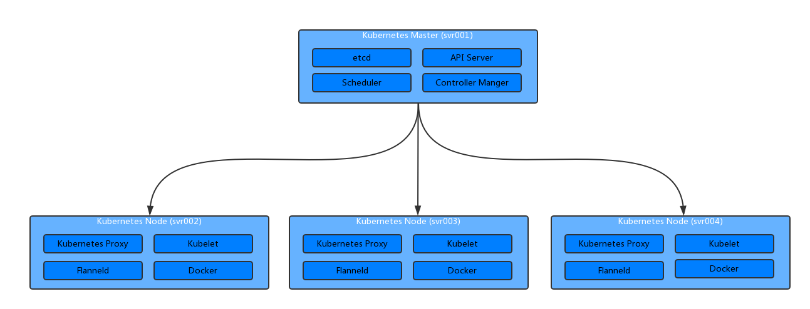

# Kubernetes 简介与安装


## 组件

整体结构如下图:



以下简单介绍下各模块：
### master 组件
- kube-apiserver   
  kube-apiserver 提供了 api 功能，相当于 kubernetes crontrol plane 的前端部分。
- etcd   
  etcd 做为 kubernetes 的后端存储部分，集群所有数据都存放在这里，所以一般而言需备份 etcd 数据。
- kube-controller-manager   
  controller 是处理任务的后台进程，kuber-controller-manager 管理这些 controller。理论上讲每个 controller 都应是一个单独的线程，不过为方便起见，kubernetes 将所有 controller 都放在一个进程中运行。controller 有如下几类：
  - Node Controller: 用来通知并响应何时 node 下线。
  - Replication Controller: 管理 pod 的正确数量。
  - Endpoints Controller: 产生 endpoint 对象。
  - Service Account & Token Controller: 创建账户和 token。
- kube-scheduler    
  给创建的 pod 指定 node

### node 组件
- kubelet    
  kubelet 是主要的 node 客户端服务，其提供 pod 相关的操作。
- kube-proxy   
  管理 service 的入口，kube-proxy 允许 kubernetes 服务进行网络连接的转发。
- docker   
  用来运行容器。
- supervisord   
  用于守护 kubelet 和 docker 运行。

## 安装
### 条件
在正式安装前，确保如下几点满足条件：
- 服务器操作系统版本为 Ubuntu16.04+，CentOS7 或 HypriotOS v1.0.1+
- 每台服务器至少 1GB 内存
- 服务器间网络互通
- 关闭防火墙和 iptables
  命令如下：
  ```
  $ sudo setenforce 0
  $ sudo systemctl disable iptables-services firewalld
  $ sudo systemctl stop iptables-services firewalld
  ``` 
- 各节点时间一致，这点可通过配置 ntp 服务实现。
- 如下端口可用

 Node type | Port | Purpose
-----------|-----------|-----------
 Master    | 6443      | Kubernetes API Server
 Master    | 2379-2380 | etcd Server Client API
 Master/Node    | 10250     | Kubelet API
 Master    | 10251     | kube-scheduler
 Master    | 10252     | kube-controller-manager
 Master/Node      | 10255     | Read-only Kubelet API (Heapster)
 Node      | 30000-32767 | Node 上服务随机使用的端口


本次测试机器情况如下：

 Hostname | IP |  OS | Memory | Network | Port
---------|-------|--------|------|---------
 svr001  | 192.168.100.10 | CentOS7.1 | 128G | 满足条件 | 满足条件
 svr002  | 192.168.100.11 | CentOS7.1 | 128G | 满足条件 | 满足条件
 svr003  | 192.168.100.12 | CentOS7.1 | 128G | 满足条件 | 满足条件
 svr004  | 192.168.100.13 | CentOS7.1 | 128G | 满足条件 | 满足条件

### 安装 Kubernetes

安装 kubernetes 的方式较多，比如官网上使用 kubectl 进行安装；若希望开发或调试 kubernetes，可通过编译安装；使用 kubeadm 可以学习官方在集群配置方面的一些最佳实践，不过该方法目前仍在测试版本中，因此不能用于正式环境使用。这里使用[二进制预编译包](https://github.com/kubernetes/kubernetes/releases)安装。在各节点上下载最新版 kubernetes 后解压，如下：
```
$ cd kubernetes/cluster
// 若需设置 proxy 才能访问外网，可先在 get-kube-binaries.sh 中进行设置 export https_proxy=http://SERVER:PROT/
$ ./get-kube-binaries.sh
$ cd ../server
$ tar xvzf kubernetes-server-linux-amd64.tar.gz
$ cd kubernetes/server/bin
$ rm *.tar *_tag
// 这里可以将 kubernetes 组件 owner 置为 root
// $ sudo chown root:root *
$ sudo chmod 755 *
$ sudo cp * /usr/bin
```

接下来修改 Kubernetes 配置 `/etc/kubernetes/config`，参考配置如下：
```
# logging to stderr means we get it in the systemd journal
KUBE_LOGTOSTDERR="--logtostderr=true"

# journal message level, 0 is debug
KUBE_LOG_LEVEL="--v=0"

# Should this cluster be allowed to run privileged docker containers
KUBE_ALLOW_PRIV="--allow-privileged=false"

# How the replication controller and scheduler find the kube-apiserver
KUBE_MASTER="--master=http://svr001:8080"
```
根据角色不同，以下分别叙述 Kubernetes Master 和 Kubernetes Minion 上的部署。

#### Kubernetes Master 

- 下载 [etcd](https://github.com/coreos/etcd/releases)，解压后将 etcd, etcdctl 移动到 /usr/bin 目录下。
- 配置 etcd。
创建工作目录`/var/lib/etcd/default.etcd` 和配置文件目录 `/etc/etcd`，新建配置文件 `/etc/etcd/etcd.conf`，参考配置如下：
```
# [member]
ETCD_NAME=default
ETCD_DATA_DIR="/var/lib/etcd/default.etcd"
ETCD_LISTEN_CLIENT_URLS="http://0.0.0.0:2379"

# [cluster]
ETCD_ADVERTISE_CLIENT_URLS="http://localhost:2379"
```

创建 etcd 的服务文件`/usr/lib/systemd/system/etcd.service` 用于 systemd 使用，其文件内容如下：
```
[Unit]
Description=Etcd Server
After=network.target

[Service]
Type=simple
WorkingDirectory=/var/lib/etcd/
EnvironmentFile=/etc/etcd/etcd.conf
ExecStart=/usr/bin/etcd

[Install]
WantedBy=multi-user.target
```
- 配置 Kubernetes ApiServer，新建配置文件 `/etc/kubernetes/apiserver`，参考配置如下：
```
KUBE_API_ADDRESS="--address=0.0.0.0"
KUBE_API_PORT="--port=8080"
KUBELET_PORT="--kubelet_port=10250"
KUBE_ETCD_SERVERS="--etcd_servers=http://127.0.0.1:2379"
KUBE_SERVICE_ADDRESSES="--service-cluster-ip-range=10.254.0.0/16"
```
- 参考[kubernetes systemd](https://github.com/kubernetes/contrib/tree/master/init/systemd)，将 kube-apiserver.service，kube-controller-manager.service 和 kube-scheduler.service 拷贝到 `/usr/lib/systemd/system` 目录下。将 environ 中各文件拷贝到 `/etc/kubernetes` 目录下。

各 service 文件中指定启动 user 为 kube，因此还需要做如下操作：
```
$ sudo useradd kube
$ sudo chown -R kube:kube /var/run/kubernetes
```

- 如架构图中所示，启动 etcd, API Server, Scheduler, Controller Manager 等 Master 组件：
```
$ sudo systemctl daemon-reload
$ for SERVICES in etcd kube-apiserver kube-controller-manager kube-scheduler; do
    sudo systemctl restart $SERVICES
    sudo systemctl enable $SERVICES
    sudo systemctl status $SERVICES 
done
```
若 status service 返回：`Active: active (running)`，则启动成功。如果启动失败，通过 `sudo journalctl -xe` 查看原因。

#### Kubernetes Minion
- 在安装 Kubernetes 前，先安装 Docker，由于 docker 依赖的 `container-selinux` 包在 extras repo 中，因此需要先将该repo开启（默认开启）。执行命令如下：
```
// 开启 extras
$ sudo yum-config-manager --enable extras
$ sudo yum -y install yum-utils device-mapper-persistent-data lvm2
$ sudo yum-config-manager --add-repo https://download.docker.com/linux/centos/docker-ce.repo
$ sudo yum makecache fast
$ sudo yum -y install docker-ce
$ yum list docker-ce.x86_64  --showduplicates | sort -r
$ sudo systemctl start docker
$ sudo docker run hello-world
```
若 yum 无法访问外网，可在 /etc/yum.conf 中设置 proxy 代理；若 docker 无法访问外网，参考 [Control and configure Docker with systemd](https://docs.docker.com/engine/admin/systemd/) 设置代理。
- 下载 [flannel](https://github.com/coreos/flannel/releases)，解压后将 flanneld 移动到 /usr/bin 目录下。同时将 kubernetes/cluster/centos/node/bin/remove-docker0.sh 移到 /usr/bin 目录下，该脚本用来删除 docker 默认网络，使用 flannel 网络。
- 编辑 `/etc/sysconfig/flanneld`，内容如下：
```
FLANNEL_ETCD_ENDPOINTS="http://srv001:2379"
FLANNEL_ETCD_PREFIX="/kube/network"
```
由于默认情况下，flannedl 会读取 etcd 上 `/coreos.com/network/config` 的配置，若想修改该配置，可通过`--etcd-prefix`（即配置中的 `FLANNEL_ETCD_PREFIX`）来覆盖该配置。 
- 在 etcd 中配置网络。
执行命令：`etcdctl set /kube/network/config '{"Network": "10.8.0.0/16", "SubnetLen": 24, "Backend": {"Type": "vxlan"}}'`。
flannel 默认 Backend 为 `udp`，[由于 udp 适用于 debug](https://coreos.com/flannel/docs/latest/backends.html)，所以这里修改为 `vxlan`，另外注意 etcd 中 value 为 JSON 格式。
- 创建目录 `/etc/kubernetes`，新建文件 `/etc/kubernetes/kubelet`，内容如下：
```
KUBELET_ADDRESS="--address=0.0.0.0"
KUBELET_PORT="--port=10250"
KUBELET_API_SERVER="--api-servers=http://srv001:8080"
KUBELET_ARGS="--cgroup-driver=systemd"
``` 
- 编辑 `/etc/kubernetes/proxy`，内容如下：
```
KUBE_PROXY_ARGS=""
```
- 将 [kubernetes systemd](https://github.com/kubernetes/contrib/tree/master/init/systemd) 中的 kubelet.service 和 kube-proxy.service 拷贝到 /

- 启动服务：
```
$ sudo systemctl daemon-reload
$ for SERVICES in kube-proxy kubelet flanneld docker; do
    sudo systemctl restart $SERVICES
    sudo systemctl enable $SERVICES
    sudo systemctl status $SERVICES
done
```
## 报错
在安装过程中，有如下几个报错，以下分别是解决过程
### docker 依赖 
```
$ sudo yum install docker-ce
...
Error: Package: docker-ce-17.06.1.ce-1.el7.centos.x86_64 (docker-ce-stable)
           Requires: libdevmapper.so.1.02(DM_1_02_97)(64bit)
Error: Package: docker-ce-17.06.1.ce-1.el7.centos.x86_64 (docker-ce-stable)
           Requires: container-selinux >= 2.9
 You could try using --skip-broken to work around the problem
```

这个原因在 [Get Docker EE for Red Hat Enterprise Linux](https://docs.docker.com/engine/installation/linux/docker-ee/rhel/) 找到答案：
> Enable the extras RHEL repository. This ensures access to the `container-selinux` package which is required by docker-ee.

查看 /etc/yum.repos.d 中 extras 相关的repo文件，打开 extras 对应的 baseurl，未发现 `container-selinux`，查看 [CentOS7 extras repo](http://mirror.centos.org/centos/7/extras/x86_64/Packages/)，能找到 container-selinux-2.19 等，于是在 /etc/yum.repos.d 中新建 repo 源，拷贝阿里的 yum 源：`wget -O /etc/yum.repos.d/CentOS-Base.repo http://mirrors.aliyun.com/repo/Centos-7.repo`。再 `yum makecache`后，重新安装，解决问题。解决方法业已在 [Docs to be updated for container-selinux](https://github.com/docker/for-linux/issues/21)提及。

### Package does not match intended download
一台机器在安装 docker 过程中报错：
```
$ sudo yum -y install docker-ce
...
https://download.docker.com/linux/centos/7/x86_64/stable/Packages/docker-ce-17.06.1.ce-1.el7.centos.x86_64.rpm: [Errno -1] Package does not match intended download. Suggestion: run yum --enablerepo=docker-ce-stable clean metadata
Trying other mirror.


Error downloading packages:
  docker-ce-17.06.1.ce-1.el7.centos.x86_64: [Errno 256] No more mirrors to try.
```
感觉很奇怪，其他机器全都 yum 安装成功，这台机器安装失败，尝试`yum --enablerepo=docker-ce-stable clean metadata`再安装，仍失败，对比该机器配置与其他机器，也未发现异常。无奈只能手动下载 https://download.docker.com/linux/centos/7/x86_64/stable/Packages/docker-ce-17.06.1.ce-1.el7.centos.x86_64.rpm 。下载完成后，执行`sudo yum -y install docker-ce-17.06.1.ce-1.el7.centos.x86_64.rpm`。安装成功

### Couldn't fetch network config: client: etcd cluster is unavailable or misconfigured
配置完 flanneld，启动报错：`Couldn't fetch network config: client: etcd cluster is unavailable or misconfigured`，提示找不到 etcd 服务。查看 `/etc/sysconfig/flanneld`，内容为：
```
FLANNEL_ETCD_ENDPOINTS="http://10.8.122.167:2379"
FLANNEL_ETCD_PREFIX="/kube/network"
```

在 flanneld 官网中有这么一段话：
> The command line options outlined above can also be specified via environment variables. For example --etcd-endpoints=http://10.0.0.2:2379 is equivalent to FLANNELD_ETCD_ENDPOINTS=http://10.0.0.2:2379 environment variable. Any command line option can be turned into an environment variable by prefixing it with FLANNELD_, stripping leading dashes, converting to uppercase and replacing all other dashes to underscores.

将 FLANNEL 修改为 FLANNELD 后，重启 flanneld 即可。

## 参考
- [CentOS install Kubernetes](https://kubernetes.io/docs/getting-started-guides/centos/centos_manual_config/)
- [Get Docker CE for CentOS](https://docs.docker.com/engine/installation/linux/docker-ce/centos/)
- [Kubernetes systemd](https://github.com/kubernetes/contrib/tree/master/init/systemd)
