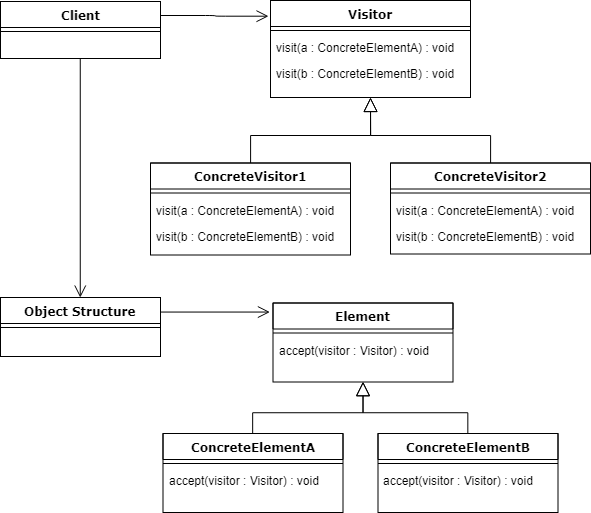

# Kubectl 介绍

kubectl 的起点是 [kubernetes/cmd/kubectl/kubectl.go](https://github.com/kubernetes/kubernetes/blob/release-1.13/cmd/kubectl/kubectl.go)，可以看到通过 `cmd.NewDefaultKubectlCommand()` 跳到了 [kubernetes/pkg/kubectl/cmd/cmd.go](https://github.com/kubernetes/kubernetes/blob/release-1.13/pkg/kubectl/cmd/cmd.go#L447)，而在该处，我们可以看到一系列 kubectl 支持的子命令。这里主要看下 create 命令，其他命令类推。

create 命令的细节在 [kubernetes/pkg/kubectl/cmd/create/create.go](https://github.com/kubernetes/kubernetes/blob/release-1.13/pkg/kubectl/cmd/create/create.go#L93) 中实现，查看 cmd.go 中调用的 `NewCmdCreate()`，关注其 `Run` 字段，最主要的命令：

```
cmdutil.CheckErr(o.RunCreate(f, cmd))
```

而对于 [RunCreate](https://github.com/kubernetes/kubernetes/blob/release-1.13/pkg/kubectl/cmd/create/create.go#L206) 命令，其内容大概如下（已减少大部分其他代码）：
```
func (o *CreateOptions) RunCreate(f cmdutil.Factory, cmd *cobra.Command) error {
	...

	r := f.NewBuilder().
		Unstructured().
		Schema(schema).
		ContinueOnError().
		NamespaceParam(cmdNamespace).DefaultNamespace().
		FilenameParam(enforceNamespace, &o.FilenameOptions).
		LabelSelectorParam(o.Selector).
		Flatten().
		Do()

	err = r.Visit(func(info *resource.Info, err error) error {
		...

		if !o.DryRun {
			if err := createAndRefresh(info); err != nil {
				return cmdutil.AddSourceToErr("creating", info.Source, err)
			}
		}

		return o.PrintObj(info.Object)
	})
	...
}
```

可以看到，`RunCreate()` 通过 Builder 的 [Do()](https://github.com/kubernetes/cli-runtime/blob/release-1.13/pkg/genericclioptions/resource/builder.go#L1072) 方法返回了一个 [Result](https://github.com/kubernetes/cli-runtime/blob/release-1.13/pkg/genericclioptions/resource/result.go#L37) 对象，其结构定义如下：
```
// Result contains helper methods for dealing with the outcome of a Builder.
type Result struct {
	err     error
	visitor Visitor

	sources            []Visitor
	singleItemImplied  bool
	targetsSingleItems bool

	mapper       *mapper
	ignoreErrors []utilerrors.Matcher

	// populated by a call to Infos
	info []*Info
}
```

对于 `Do()` 方法我们重点关注其对 `visitor` 的修改，如下：
```
// Do returns a Result object with a Visitor for the resources identified by the Builder.
// The visitor will respect the error behavior specified by ContinueOnError. Note that stream
// inputs are consumed by the first execution - use Infos() or Object() on the Result to capture a list
// for further iteration.
func (b *Builder) Do() *Result {
	r := b.visitorResult()
	r.mapper = b.Mapper()
	...
	if b.continueOnError {
		r.visitor = NewDecoratedVisitor(ContinueOnErrorVisitor{r.visitor}, helpers...)
	} else {
		r.visitor = NewDecoratedVisitor(r.visitor, helpers...)
	}
	return r
}
```

正常情况下：`r.visitor = NewDecoratedVisitor(r.visitor, helpers...)`，即 `visitor` 为一个 [DecoratedVisitor](https://github.com/kubernetes/cli-runtime/blob/release-1.13/pkg/genericclioptions/resource/visitor.go#L297) 对象。由于拿到 Result 对象后，会调用其 [Visit()](https://github.com/kubernetes/cli-runtime/blob/release-1.13/pkg/genericclioptions/resource/result.go#L95) 方法，而该方法会调用 Result 对象的 `visitor` 属性的 `Visit()`，所以接着看 `DecoratedVisitor` 的 [Visit()](https://github.com/kubernetes/cli-runtime/blob/release-1.13/pkg/genericclioptions/resource/visitor.go#L305) 方法，如下：
```
func (v DecoratedVisitor) Visit(fn VisitorFunc) error {
	return v.visitor.Visit(func(info *Info, err error) error {
		if err != nil {
			return err
		}
		for i := range v.decorators {
			if err := v.decorators[i](info, nil); err != nil {
				return err
			}
		}
		return fn(info, nil)
	})
}
```

`Visit()` 接着又执行了 [createAndRefresh()](https://github.com/kubernetes/kubernetes/blob/release-1.13/pkg/kubectl/cmd/create/create.go#L321) 方法，如下：
```
func createAndRefresh(info *resource.Info) error {
	obj, err := resource.NewHelper(info.Client, info.Mapping).Create(info.Namespace, true, info.Object, nil)
	if err != nil {
		return err
	}
	info.Refresh(obj, true)
	return nil
}
```

查看 resource 的 `Create()` 方法，可以看到查会调用 [createResource()](https://github.com/kubernetes/cli-runtime/blob/release-1.13/pkg/genericclioptions/resource/helper.go#L132)，此时会发起一个 REST 请求并返回一个包括响应的 Resut 对象：
```
c.Post().
	NamespaceIfScoped(namespace, m.NamespaceScoped).
	Resource(resource).
	VersionedParams(options, metav1.ParameterCodec).
	Body(obj).
	Do().
	Get()
```

至此，`create` 算完成了。

由上可以看到，其中涉及了 Builder 模式和 Visitor 模式调用 REST 请求，并返回响应结果。

## Visitor 设计模式简介

由于 kubectl 中使用了 visitor 设计模式，这里简单讲解下其内容。

先看下 visitor 模式的 UML 图：

 

其主要由接口 visitor （抽象访问者）及其实现类（具体访问者），接口 element （抽象元素）及其实现类（具体元素）和对象结构组成。
- 抽象访问接口（visitor 接口）为具体元素类声明一个访问操作接口（通过 `visit()` 方法）
- 具体访问者实现抽象访问接口中定义的操作，提供具体实现类需要的操作。
- 抽象元素接口（element 接口）接受（accept）抽象访问者。
- 具体元素类接受抽象访问者。
- 对象结构遍历所有元素，接收各自访问者，访问者调用 `visit()` 方法执行具体元素类想执行的操作。

代码 demo 如下：

```
package main

import (
	"fmt"
	)

type IVisitor interface {
	Visit(IElement)
}

type ConcreteVisitor1 struct {}

func (v *ConcreteVisitor1) Visit(element IElement) {
	switch element.(type) {
	case *ConcreteElementA:
		fmt.Println("using ConcreteVisitor1. I'm concrete element a.")
	case *ConcreteElementB:
		fmt.Println("using ConcreteVisitor1. I'm concrete element b.")
	}
}

type ConcreteVisitor2 struct {}

func (v *ConcreteVisitor2) Visit(element IElement) {
	switch element.(type) {
	case *ConcreteElementA:
		fmt.Println("using ConcreteVisitor2. I'm concrete element a.")
	}
}

type IElement interface {
	Accept(visitor IVisitor)
}

type ConcreteElementA struct {}

func (e *ConcreteElementA) Accept(visitor IVisitor) {
	visitor.Visit(e)
}

type ConcreteElementB struct {}

func (e *ConcreteElementB) Accept(visitor IVisitor) {
	visitor.Visit(e)
}

type ObjectStructure struct {
	Items []IElement
}

func (ob *ObjectStructure) Add(element IElement) {
	ob.Items = append(ob.Items, element)
}

func (ob *ObjectStructure) Accept(visitor IVisitor) {
	for _, item := range ob.Items {
		item.Accept(visitor)
	}
}

func main() {
	ob := new(ObjectStructure)
	ob.Add(new(ConcreteElementA))
	ob.Add(new(ConcreteElementB))

	visitor1 := new(ConcreteVisitor1)
	ob.Accept(visitor1)

	visitor2 := new(ConcreteVisitor2)
	ob.Accept(visitor2)
}
```

## 参考
- [java visitor pattern](https://www.baeldung.com/java-visitor-pattern)
- [visitor.go](https://github.com/senghoo/golang-design-pattern/blob/master/23_visitor/visitor.go)

