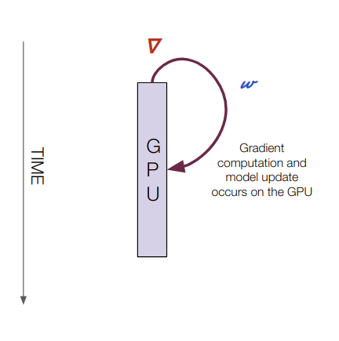
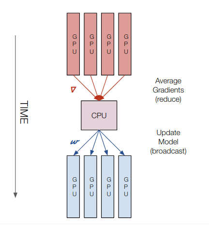
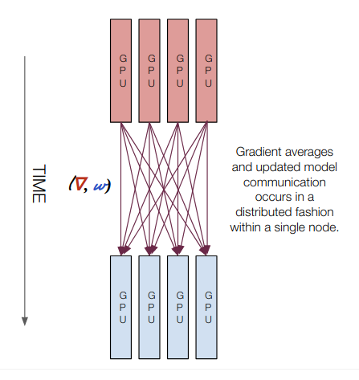
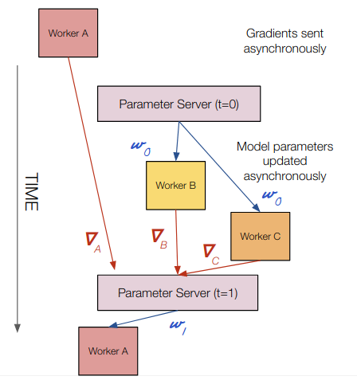
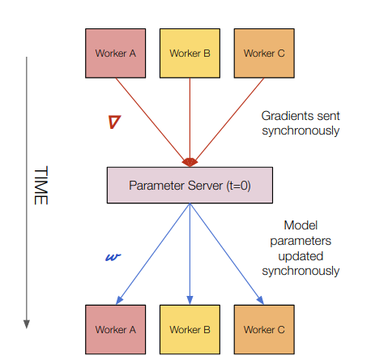
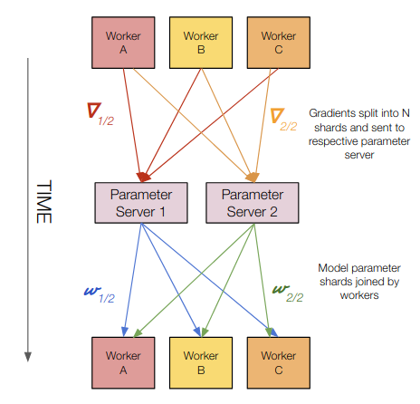

# 分布式训练方案

## 类型
分布式训练有如下几种类型：

### Single GPU

- 计算位置：单个 GPU 上
- 梯度传递：N/A
- 模型传递：N/A

### Multi GPU Training (CPU Parameter Server)

- 计算位置：CPU 和所有 GPU 上
- 梯度传递：从 GPU 到 CPU (reduce)
- 模型传递：从 CPU 到 GPU (BROADCAST)

### Multi GPU Training (Multi GPU all-reduce)

- 计算位置：所有 GPU 
- 梯度传递：在 NCCL all-reduce 期间从 GPU 到 GPU 
- 模型传递：在 NCCL all-reduce 期间从 GPU 到 GPU

### Asynchronous Distributed SGD

- 计算位置：所有 worker 和 parameters 服务器 
- 梯度传递：从 worker 服务器异步到 parameter 服务器 
- 模型传递：从 parameter 服务器异步到 worker 服务器

### Synchronous Distributed SGD

- 计算位置：所有 worker 和 parameters 服务器
- 梯度传递：从 worker 服务器到 parameter 服务器 
- 模型传递：从 parameter 服务器到 worker 服务器

### Multiple Parameter Servers

- 计算位置：所有 worker 和 parameters 服务器
- 梯度传递：worker 梯度分片给 parameter 服务器 
- 模型传递：parameter 服务器的模型分片给 worker 服务器

### Ring all-reduce Distributed Training

- 计算位置：所有 worker 服务器
- 梯度传递：all-reduce 期间 worker 服务器传输梯度给对应的节点
- 模型传递：多节点 all-reduce 操作结束后执行模型“更新”

## 参考
- [Distributed Training: A Gentle Introduction](https://lambdalabs-files.s3-us-west-2.amazonaws.com/lambdalabs.com_presents_distributed-training-a-gentle-introduction.pdf)
