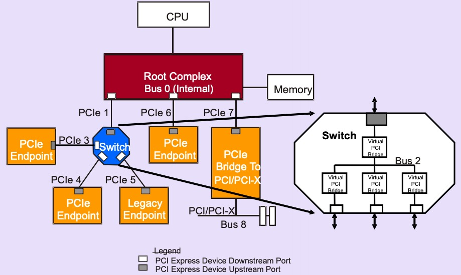
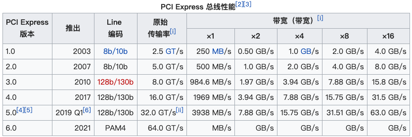
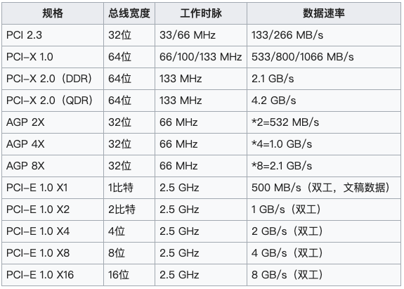
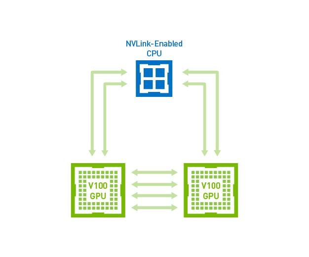
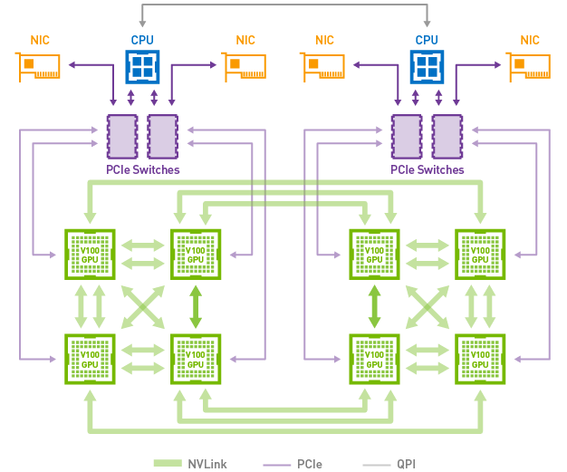
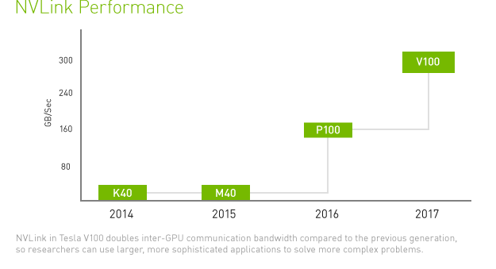
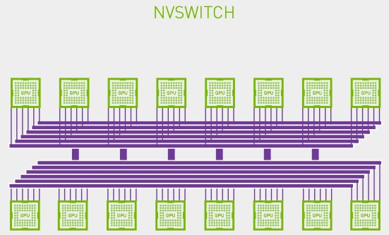

# PCI、PCIe 和 NVLink 介绍

## PCI
PCI(Peripheral Component Interconnect) 是一种连接计算机主板与外部设备的总线标准。典型的 PCI 结构如下：

CPU，内存和 PCI 总线通过 PCI 主桥（host bridge）连接，通过 PCI 主桥，CPU 可直接访问独立于其他 PCI 总线的主内存。另外 PCI 主桥能扩展从属 PCI 总线网桥，以使单系统扩展为带有多条辅助总线的复杂系统，PCI 主桥还可提供 CPU 与外围 I/O 设备之间的数据访问映射，该桥会将每个外围设备映射到**主机地址域**，以便处理器访问此设备。在 PCI 总线端，PCI 主桥会将系统内存映射到 **PCI 地址域**，以便 PCI 设备可以作为总线主控器访问内存。

参考[维基百科](https://zh.wikipedia.org/wiki/%E5%A4%96%E8%AE%BE%E7%BB%84%E4%BB%B6%E4%BA%92%E8%BF%9E%E6%A0%87%E5%87%86)，可以看到 PCI 总线主要分为如下三个部分：
- PCI 设备    
  能匹配 PCI 总线标准的设备即可称为 PCI 设备，PCI 总线架构中可包含多个 PCI 设备。如上图中的 LAN，SCSI 等。常见的 PCI 设备包括网卡、声卡、硬盘控制器和 USB 等端口，原本显卡也是 PCI 设备，但当前 PCI 已不足以支持显卡的性能了。
- PCI 总线    
  在系统中可以有多条，类似于树状结构进行扩展。每条 PCI 总线都可以连接多个 PCI 设备/桥。通过桥实现上下级 PCI 总线互连。如上图有两条 PCI 总线。
- PCI 桥   
  连接 PCI 总线之间的纽带。如上图的 PCI-to-PCI Bridge。

PCI 的特点：
- PCI 是个并行总线。在一个时钟周期内 32 个 bit（后扩展到 64）同时被传输。地址和数据在一个时钟周期内按照协议，分别一次被传输。
- PCI 地址空间与处理器地址空间隔离。在 PCI 主桥中含有许多缓冲，这些缓冲使得处理器总线与PCI总线工作在各自的时钟频率中，彼此互不干扰。

## PCIe

随着数据传输越来越高的要求，PCI-X 和 AGP 走了两条不同的路线: PCI-X 不断提高时钟频率，而 AGP 则是在一个时钟周期内传输多次数据来提速。不过随着频率的提升，并行传输遇到了干扰问题。而在 2001 年 Intel 公布了取代 PCI 总线的第三代 I/O 技术，2002 年 PCI-SIG 审核通过 PCIe 相关的规范。PCIe 的拓扑结构如下：

### PCIe 硬件协议
PCIe 基于一个单向的**点对点连接**，其被称为 lane，一个典型结构是一个 root port 与一个 endpoint 组成一个 lane，而 Switch 可同时连接几个 endpoint，一个 lane 需要一个单独的 PCI bus。这一点 PCIe 与早期 PCI 连接不同，PCI 连接基于总线控制，所有设备共享双向并行总线。PCIe 是一个多层协议，由事务层、数据交换层和物理层组成，物理层又可以分为逻辑子层和电气子层，逻辑子层又可分为物理代码子层（PCS）和介质接入控制子层（MAC）。

- 物理层  
  使用两个单向的低电压差分信号合计达到 2.5Gbit/s，两个 PCIe 设备之间的连接成为“链接”，形成一组或多组传输通道。
- 数据链路层   
  数据链路层采用按序的交换层信息包(TLPs)，是由交换层生成，按 32 位 CRC 进行数据保护。TLPs 能通过 CRC 校验和连续性校验的称为 Ack（命令正确应答）；没有通过校验的称为 Nak（没有应答）。没有应答的 TLPs 或者等待逾时的 TLPs 会被重新传输。
- 事务层   
  PCIe 采用分离交换，可保证传输通道在目标端设备发送回应信息传送其他数据信息。 

PCIe 规范主要是为了提升计算机内部所有总线的速度，因此带宽有多种不同规格标准，参考维基百科：

以上带宽是单向 lane 计算的，若是双工方式，则带宽还需要乘以 2，如 PCIe Gen3 x16 双工的带宽会接近 32GB/s 左右。

以下是 PCIe 与其他传输规格的对比：

PCIe 相比 PCI 最大的改变是由并行改为了串行，并通过差分信号传输来纠正干扰，从而能大幅提高频率。对于差分信号的一些特性，参考[维基百科](https://zh.wikipedia.org/wiki/%E5%B7%AE%E5%88%86%E4%BF%A1%E5%8F%B7)，如下：
> 差分传输是一种信号传输的技术，区别于传统的一根信号线一根地线的做法，差分传输在这两根线上都传输信号，这两个信号的振幅相同，相位相反。在这两根线上的传输的信号就是差分信号。信号接收端比较这两个电压的差值来判断发送端发送的逻辑状态。在电路板上，差分走线必须是**等长、等宽、紧密靠近、且在同一层面**的两根线。
> 
> 差分信号与传统的一根信号线一根地线（即单端信号）走线的做法相比，其优缺点分别是：
>
> 优点：
>   1. 抗干扰能力强。干扰噪声一般会等值、同时的被加载到两根信号线上，而其差值为0，即，噪声对信号的逻辑意义不产生影响。
>   2. 能有效抑制电磁干扰（EMI）。由于两根线靠得很近且信号幅值相等，这两根线与地线之间的耦合电磁场的幅值也相等，同时他们的信号极性相反，其电磁场将相互抵消。因此对外界的电磁干扰也小。
>   3. 时序定位准确。差分信号的接收端是两根线上的信号幅值之差发生正负跳变的点，作为判断逻辑0/1跳变的点的。而普通单端信号以阈值电压作为信号逻辑0/1的跳变点，受阈值电压与信号幅值电压之比的影响较大，不适合低幅度的信号。
> 
> 缺点：
>   1. 若电路板的面积非常吃紧，单端信号可以只有一根信号线，地线走地平面，而差分信号一定要走两根等长、等宽、紧密靠近、且在同一层面的线。这样的情况常常发生在芯片的管脚间距很小，以至于只能穿过一根走线的情况下。

另外 PCI 由于地址/数据线太多，不得不复用线路，因此基本都是半双工的，而串行能做到全双工。

## NVLink
由于 PCIe 带宽日益成为多 GPU 系统级别的瓶颈，深度学习工作负载的快速增长使得对更快速、更可扩展的互连的需求逐渐增加。NVLink™ 技术提供更高带宽与更多链路，并可提升多 GPU 和多 GPU/CPU 系统配置的可扩展性。如下是官网的几张图：

Tesla V100 中以 NVLink 连接的 GPU 至 GPU 和 GPU 至 CPU 通信（六条 NVLink 链路）:

在 DGX-1V 服务器中，混合立体网络拓扑使用 NVLink 连接 8 个 Tesla V100 加速器:

而根据官网数据，使用 NVLink 的 P100 的带宽是 160GB/s，是 PCIe GEN3 x16 带宽的 5 倍左右。而在 V100 中，由于其支持多达六条 NVLink 链路，使得总带宽为 300 GB/s，这是 PCIe GEN3 x16 带宽的 10 倍。

### NVSwitch
> NVLink 实现了很大的进步，可以在单个服务器中支持八个 GPU，并且可提升性能，使之超越 PCIe。但是，要将深度学习性能提升到一个更高水平，将需要使用 GPU 架构，该架构在一台服务器上支持更多的 GPU 以及 GPU 之间的全带宽连接。

> NVIDIA NVSwitch 是首款节点交换架构，可支持单个服务器节点中 16 个全互联的 GPU，并可使全部 8 个 GPU 对分别以 300 GB/s 的惊人速度进行同时通信。这 16 个全互联的 GPU 还可作为单个大型加速器，拥有 0.5 TB 统一显存空间和 2 PetaFLOPS 计算性能。

## 参考
- [PCI vs PCIe](https://wiki.qemu.org/images/f/f6/PCIvsPCIe.pdf)
- [PCI 局部总线](https://docs.oracle.com/cd/E19253-01/819-7057/hwovr-22/index.html)
- [PCI Express](https://zh.wikipedia.org/wiki/PCI_Express)
- [深入PCI与PCIe之一：硬件篇](https://zhuanlan.zhihu.com/p/26172972)
- [NVLINK结构](https://www.nvidia.cn/data-center/nvlink/)
