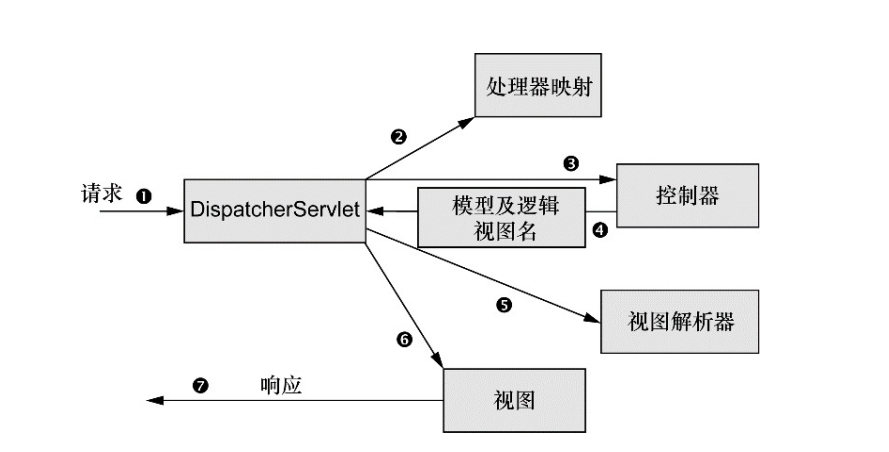

# Spring MVC

## Spring MVC 处理请求的过程
如下图是 Spring MVC 请求经历的所有站点:


- 同大多数 Java Web 框架一样，Spring MVC 的请求会先通过一个前端控制器 Servlet，在 Spring 中即 `DispatcherServlet`。
- `DispatcherServlet` 的任务是将请求发送给 Spring MVC 控制器（controller）。一般应用程序会有多个 controller，所以 `DispatcherServlet` 会查询一个或多个处理器映射（handler mapper）来确定合适的控制器。处理映射器会根据请求所携带的 URL 信息来进行决策。
- 一旦确定合适的控制器后， `DispatcherServlet` 会将请求发送给选中的控制器，控制器会读取用户提交的信息并开始处理数据（一般而言，设计良好的控制器基本不处理工作，而是将业务逻辑委托给服务对象处理）。
- 控制器在完成逻辑处理后，通常会返回一些信息，这些信息被称为模型（model），控制器将模型数据打包，并标示出用于渲染输出的视图名。接下来连同模型和视图名发送回 `DispatcherServlet`。
- `DispatcherServlet` 使用视图解析器（view resolver）将逻辑视图名匹配为一个特定的视图实现。
- `DispatcherServlet` 将模型数据交给视图渲染结果。
- 视图将模型结果通过响应传递给客户端。

在正式使用 Spring MVC 前，先说下 Spring MVC 的搭建过程。

## Spring MVC 的搭建过程
### 配置 `DispatcherServlet`
按照传统方式，像 `DispatcherServlet` 这样的 servelt 会配置在 web.xml 中，但借助于 Servlet 3 规范和 Spring 3.1 的功能增强，我们可以在代码中通继承 `AbstractAnnotationConfigDispatcherServletInitializer` 来实现 `DispatcherServlet` 的配置。

[AbstractAnnotationConfigDispatcherServletInitializer](https://docs.spring.io/spring/docs/5.1.6.RELEASE/javadoc-api/org/springframework/web/servlet/support/AbstractAnnotationConfigDispatcherServletInitializer.html) 提供了创建 root application (代理给`ContextLoaderListener.ContextLoaderListener` 创建 `DispatcherServlet` 的父上下文）和 servlet application 的方法，并通过 `getRootConfigClasses()` 指定 root 配置类和 `getServletConfigClasses` 指定 `DispatcherServlet` 配置类：

```

public class SpittrWebAppInitializer extends AbstractAnnotationConfigDispatcherServletInitializer {
	
    ...
    @Override
    protected Class<?>[] getRootConfigClasses() {
        return new Class<?>[]{RootConfig.class};
    }

    
    @Override
    protected Class<?>[] getServletConfigClasses() {
        return new Class<?>[]{WebConfig.class};
    }
    
    ...
}
```

### 启用 Spring MVC
通过 `@EnableWebMvc` 即可启动 Spring MVC，但还有不少问题要解决：
- 用户可配置视图解析器，否则 Spring 默认使用 `BeanNameViewResolver` 来查找 ID 与视图名称匹配的 bean，并且查找找 bean 要实现 view 接口。
- 由于未启动组件扫描，Spring 只能找到显式声明在配置类中的控制器。这里可以通过 `@ComponentScan` 开启组件扫描。
- 用户还可以配置静态资源的处理。


## 编写控制器

通过 `@Controller` 声明控制器，使用 `@RequestMapping` 来匹配请求。

## 处理请求参数
Spring MVC 允许多种方式将客户端的数据传送到控制器的处理器中：
- 查询参数    
  查询参数通过 `@RequestParam` 获取。
- 路径参数    
  表单参数通过 `@PathVariable` 获取 `@RequestMapping` 中的占位符（使用`{}`）。
- 表单参数    
  通过指定对象保存。 

