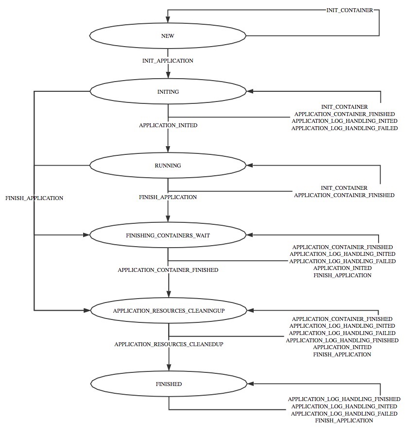

## Nodemanager中Application和container状态分析

参考[StateMachineFactory](https://github.com/apache/hadoop/blob/branch-2.6.0/hadoop-yarn-project/hadoop-yarn/hadoop-yarn-server/hadoop-yarn-server-nodemanager/src/main/java/org/apache/hadoop/yarn/server/nodemanager/containermanager/application/ApplicationImpl.java#L130)，Nodemanager中Application有如下状态:

## 参考
- [ApplicationImpl.java](https://github.com/apache/hadoop/blob/branch-2.6.0/hadoop-yarn-project/hadoop-yarn/hadoop-yarn-server/hadoop-yarn-server-nodemanager/src/main/java/org/apache/hadoop/yarn/server/nodemanager/containermanager/application/ApplicationImpl.java)
